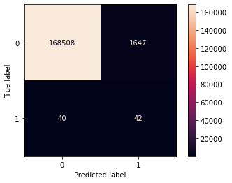
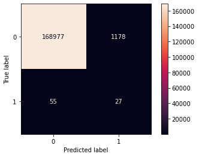
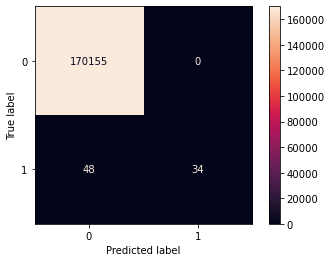
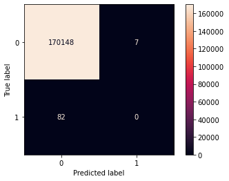
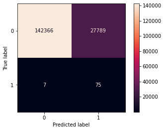
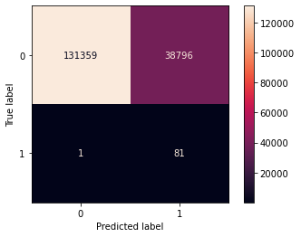

```python
import pandas as pd
import numpy as np 
import csv

import scipy.stats as scs
import statsmodels.api as sm
import statsmodels.formula.api as sms
import scipy.stats as stats

from haversine import haversine
from math import sqrt

from sklearn.model_selection import train_test_split, cross_val_score
from sklearn.metrics import accuracy_score, classification_report, confusion_matrix, roc_curve, auc
from sklearn.ensemble import RandomForestClassifier, AdaBoostClassifier, GradientBoostingClassifier 
from sklearn.naive_bayes import BernoulliNB, CategoricalNB, GaussianNB, MultinomialNB
from sklearn.model_selection import GridSearchCV, train_test_split
from sklearn.metrics import classification_report, confusion_matrix, plot_confusion_matrix, accuracy_score, precision_recall_curve, f1_score, precision_score, recall_score
from sklearn.base import BaseEstimator
from sklearn.feature_selection import SelectKBest, chi2
from sklearn.tree import DecisionTreeClassifier, plot_tree
from sklearn.pipeline import Pipeline

import matplotlib.pyplot as plt
import seaborn as sns
pd.options.display.float_format = '{:.2f}'.format
```


```python
df = pd.read_csv(r'data/ChicagoCrashes.csv')
```


```python
yes_no_converter = lambda x: 1 if x>=1 else 0
```


```python
df.describe()
```


<div>
<style scoped>
    .dataframe tbody tr th:only-of-type {
        vertical-align: middle;
    }

    .dataframe tbody tr th {
        vertical-align: top;
    }

    .dataframe thead th {
        text-align: right;
    }
</style>
<table border="1" class="dataframe">
  <thead>
    <tr style="text-align: right;">
      <th></th>
      <th>Unnamed: 0</th>
      <th>CRASH_DATE_x</th>
      <th>OCCUPANT_CNT</th>
      <th>POSTED_SPEED_LIMIT</th>
      <th>BEAT_OF_OCCURRENCE</th>
      <th>NUM_UNITS</th>
      <th>INJURIES_TOTAL</th>
      <th>INJURIES_FATAL</th>
      <th>INJURIES_INCAPACITATING</th>
      <th>INJURIES_NON_INCAPACITATING</th>
      <th>INJURIES_REPORTED_NOT_EVIDENT</th>
      <th>INJURIES_NO_INDICATION</th>
      <th>INJURIES_UNKNOWN</th>
      <th>CRASH_HOUR</th>
      <th>CRASH_DAY_OF_WEEK</th>
      <th>CRASH_MONTH</th>
      <th>LATITUDE</th>
      <th>LONGITUDE</th>
    </tr>
  </thead>
  <tbody>
    <tr>
      <th>count</th>
      <td>567454.00</td>
      <td>567454.00</td>
      <td>567454.00</td>
      <td>567454.00</td>
      <td>567454.00</td>
      <td>567454.00</td>
      <td>567454.00</td>
      <td>567454.00</td>
      <td>567454.00</td>
      <td>567454.00</td>
      <td>567454.00</td>
      <td>567454.00</td>
      <td>567454.00</td>
      <td>567454.00</td>
      <td>567454.00</td>
      <td>567454.00</td>
      <td>567454.00</td>
      <td>567454.00</td>
    </tr>
    <tr>
      <th>mean</th>
      <td>990211.98</td>
      <td>2018.06</td>
      <td>1.41</td>
      <td>28.89</td>
      <td>1233.98</td>
      <td>2.16</td>
      <td>0.25</td>
      <td>0.00</td>
      <td>0.02</td>
      <td>0.13</td>
      <td>0.09</td>
      <td>2.74</td>
      <td>0.00</td>
      <td>13.37</td>
      <td>4.15</td>
      <td>6.72</td>
      <td>41.86</td>
      <td>-87.68</td>
    </tr>
    <tr>
      <th>std</th>
      <td>594777.08</td>
      <td>1.28</td>
      <td>1.41</td>
      <td>5.92</td>
      <td>699.58</td>
      <td>0.56</td>
      <td>0.77</td>
      <td>0.03</td>
      <td>0.19</td>
      <td>0.57</td>
      <td>0.44</td>
      <td>2.01</td>
      <td>0.00</td>
      <td>5.13</td>
      <td>1.96</td>
      <td>3.39</td>
      <td>0.08</td>
      <td>0.06</td>
    </tr>
    <tr>
      <th>min</th>
      <td>1.00</td>
      <td>2015.00</td>
      <td>0.00</td>
      <td>0.00</td>
      <td>111.00</td>
      <td>1.00</td>
      <td>0.00</td>
      <td>0.00</td>
      <td>0.00</td>
      <td>0.00</td>
      <td>0.00</td>
      <td>0.00</td>
      <td>0.00</td>
      <td>0.00</td>
      <td>1.00</td>
      <td>1.00</td>
      <td>41.64</td>
      <td>-87.93</td>
    </tr>
    <tr>
      <th>25%</th>
      <td>475494.25</td>
      <td>2017.00</td>
      <td>1.00</td>
      <td>30.00</td>
      <td>725.00</td>
      <td>2.00</td>
      <td>0.00</td>
      <td>0.00</td>
      <td>0.00</td>
      <td>0.00</td>
      <td>0.00</td>
      <td>2.00</td>
      <td>0.00</td>
      <td>10.00</td>
      <td>2.00</td>
      <td>4.00</td>
      <td>41.79</td>
      <td>-87.72</td>
    </tr>
    <tr>
      <th>50%</th>
      <td>965871.50</td>
      <td>2018.00</td>
      <td>1.00</td>
      <td>30.00</td>
      <td>1212.00</td>
      <td>2.00</td>
      <td>0.00</td>
      <td>0.00</td>
      <td>0.00</td>
      <td>0.00</td>
      <td>0.00</td>
      <td>2.00</td>
      <td>0.00</td>
      <td>14.00</td>
      <td>4.00</td>
      <td>7.00</td>
      <td>41.88</td>
      <td>-87.67</td>
    </tr>
    <tr>
      <th>75%</th>
      <td>1494691.25</td>
      <td>2019.00</td>
      <td>2.00</td>
      <td>30.00</td>
      <td>1821.00</td>
      <td>2.00</td>
      <td>0.00</td>
      <td>0.00</td>
      <td>0.00</td>
      <td>0.00</td>
      <td>0.00</td>
      <td>3.00</td>
      <td>0.00</td>
      <td>17.00</td>
      <td>6.00</td>
      <td>10.00</td>
      <td>41.92</td>
      <td>-87.63</td>
    </tr>
    <tr>
      <th>max</th>
      <td>2115933.00</td>
      <td>2020.00</td>
      <td>60.00</td>
      <td>99.00</td>
      <td>2535.00</td>
      <td>15.00</td>
      <td>21.00</td>
      <td>3.00</td>
      <td>6.00</td>
      <td>21.00</td>
      <td>15.00</td>
      <td>61.00</td>
      <td>0.00</td>
      <td>23.00</td>
      <td>7.00</td>
      <td>12.00</td>
      <td>42.02</td>
      <td>-87.52</td>
    </tr>
  </tbody>
</table>
</div>


```python
df.info()
```

    <class 'pandas.core.frame.DataFrame'>
    RangeIndex: 567454 entries, 0 to 567453
    Data columns (total 49 columns):
     #   Column                         Non-Null Count   Dtype  
    ---  ------                         --------------   -----  
     0   Unnamed: 0                     567454 non-null  int64  
     1   CRASH_DATE_x                   567454 non-null  int64  
     2   UNIT_TYPE                      567454 non-null  object 
     3   MAKE                           567454 non-null  object 
     4   MODEL                          567454 non-null  object 
     5   VEHICLE_DEFECT                 567454 non-null  object 
     6   VEHICLE_TYPE                   567454 non-null  object 
     7   VEHICLE_USE                    567454 non-null  object 
     8   MANEUVER                       567454 non-null  object 
     9   OCCUPANT_CNT                   567454 non-null  float64
     10  CRASH_DATE_y                   567454 non-null  object 
     11  POSTED_SPEED_LIMIT             567454 non-null  int64  
     12  TRAFFIC_CONTROL_DEVICE         567454 non-null  object 
     13  DEVICE_CONDITION               567454 non-null  object 
     14  WEATHER_CONDITION              567454 non-null  object 
     15  LIGHTING_CONDITION             567454 non-null  object 
     16  FIRST_CRASH_TYPE               567454 non-null  object 
     17  TRAFFICWAY_TYPE                567454 non-null  object 
     18  ALIGNMENT                      567454 non-null  object 
     19  ROADWAY_SURFACE_COND           567454 non-null  object 
     20  ROAD_DEFECT                    567454 non-null  object 
     21  REPORT_TYPE                    567454 non-null  object 
     22  CRASH_TYPE                     567454 non-null  object 
     23  DAMAGE                         567454 non-null  object 
     24  PRIM_CONTRIBUTORY_CAUSE        567454 non-null  object 
     25  SEC_CONTRIBUTORY_CAUSE         567454 non-null  object 
     26  BEAT_OF_OCCURRENCE             567454 non-null  float64
     27  NUM_UNITS                      567454 non-null  int64  
     28  MOST_SEVERE_INJURY             567454 non-null  object 
     29  INJURIES_TOTAL                 567454 non-null  float64
     30  INJURIES_FATAL                 567454 non-null  float64
     31  INJURIES_INCAPACITATING        567454 non-null  float64
     32  INJURIES_NON_INCAPACITATING    567454 non-null  float64
     33  INJURIES_REPORTED_NOT_EVIDENT  567454 non-null  float64
     34  INJURIES_NO_INDICATION         567454 non-null  float64
     35  INJURIES_UNKNOWN               567454 non-null  float64
     36  CRASH_HOUR                     567454 non-null  int64  
     37  CRASH_DAY_OF_WEEK              567454 non-null  int64  
     38  CRASH_MONTH                    567454 non-null  int64  
     39  LATITUDE                       567454 non-null  float64
     40  LONGITUDE                      567454 non-null  float64
     41  PERSON_ID                      567454 non-null  object 
     42  PERSON_TYPE                    567454 non-null  object 
     43  CRASH_DATE                     567454 non-null  object 
     44  SEX                            567454 non-null  object 
     45  SAFETY_EQUIPMENT               567454 non-null  object 
     46  AIRBAG_DEPLOYED                567454 non-null  object 
     47  EJECTION                       567454 non-null  object 
     48  INJURY_CLASSIFICATION          567454 non-null  object 
    dtypes: float64(11), int64(7), object(31)
    memory usage: 212.1+ MB
    


```python
# target data, what we are trying to predict, should it be death ?
print(df['INJURIES_FATAL'].sum()) # 685 deaths out of this 1.1 million line dataset - how can you predict them?
```

    331.0
    


```python
def transform_df(df): # this will create a binary encoding for fatalities in an accident,
    # 1 for a fatality was present
    # and 0 for no fatality present
    df['INJURIES_FATAL'] = df['INJURIES_FATAL'].apply(yes_no_converter)
    # df['y'] = df['y'].apply(yes_no_converter)
    return df

df = transform_df(df)
```


```python
print(df['MOST_SEVERE_INJURY'].unique()) # what can we learn by attempting to classify the most severe injury?
```

    ['NO INDICATION OF INJURY' 'NONINCAPACITATING INJURY'
     'REPORTED, NOT EVIDENT' 'INCAPACITATING INJURY' 'FATAL']
    


```python
# KNN is not good with large or wide datasets, lets choose a different method. 
```


```python
df.head()
```


<div>
<style scoped>
    .dataframe tbody tr th:only-of-type {
        vertical-align: middle;
    }

    .dataframe tbody tr th {
        vertical-align: top;
    }

    .dataframe thead th {
        text-align: right;
    }
</style>
<table border="1" class="dataframe">
  <thead>
    <tr style="text-align: right;">
      <th></th>
      <th>Unnamed: 0</th>
      <th>CRASH_DATE_x</th>
      <th>UNIT_TYPE</th>
      <th>MAKE</th>
      <th>MODEL</th>
      <th>VEHICLE_DEFECT</th>
      <th>VEHICLE_TYPE</th>
      <th>VEHICLE_USE</th>
      <th>MANEUVER</th>
      <th>OCCUPANT_CNT</th>
      <th>...</th>
      <th>LATITUDE</th>
      <th>LONGITUDE</th>
      <th>PERSON_ID</th>
      <th>PERSON_TYPE</th>
      <th>CRASH_DATE</th>
      <th>SEX</th>
      <th>SAFETY_EQUIPMENT</th>
      <th>AIRBAG_DEPLOYED</th>
      <th>EJECTION</th>
      <th>INJURY_CLASSIFICATION</th>
    </tr>
  </thead>
  <tbody>
    <tr>
      <th>0</th>
      <td>577317</td>
      <td>2016</td>
      <td>DRIVER</td>
      <td>TOYOTA MOTOR COMPANY, LTD.</td>
      <td>CAMRY</td>
      <td>NONE</td>
      <td>PASSENGER</td>
      <td>PERSONAL</td>
      <td>TURNING RIGHT</td>
      <td>1.00</td>
      <td>...</td>
      <td>41.69</td>
      <td>-87.54</td>
      <td>O35015</td>
      <td>DRIVER</td>
      <td>03/18/2016 02:50:00 PM</td>
      <td>F</td>
      <td>SAFETY BELT USED</td>
      <td>DID NOT DEPLOY</td>
      <td>NONE</td>
      <td>NO INDICATION OF INJURY</td>
    </tr>
    <tr>
      <th>1</th>
      <td>1612677</td>
      <td>2019</td>
      <td>DRIVER</td>
      <td>BUICK</td>
      <td>ENCLAVE</td>
      <td>NONE</td>
      <td>PASSENGER</td>
      <td>PERSONAL</td>
      <td>STRAIGHT AHEAD</td>
      <td>1.00</td>
      <td>...</td>
      <td>41.74</td>
      <td>-87.60</td>
      <td>O804356</td>
      <td>DRIVER</td>
      <td>12/17/2019 04:04:00 PM</td>
      <td>M</td>
      <td>SAFETY BELT USED</td>
      <td>NOT APPLICABLE</td>
      <td>NONE</td>
      <td>NO INDICATION OF INJURY</td>
    </tr>
    <tr>
      <th>2</th>
      <td>547332</td>
      <td>2018</td>
      <td>DRIVER</td>
      <td>CHEVROLET</td>
      <td>MALIBU (CHEVELLE)</td>
      <td>NONE</td>
      <td>PASSENGER</td>
      <td>PERSONAL</td>
      <td>AVOIDING VEHICLES/OBJECTS</td>
      <td>1.00</td>
      <td>...</td>
      <td>41.80</td>
      <td>-87.58</td>
      <td>O337302</td>
      <td>DRIVER</td>
      <td>03/05/2018 12:35:00 PM</td>
      <td>F</td>
      <td>SAFETY BELT USED</td>
      <td>DID NOT DEPLOY</td>
      <td>NONE</td>
      <td>NO INDICATION OF INJURY</td>
    </tr>
    <tr>
      <th>3</th>
      <td>756129</td>
      <td>2018</td>
      <td>DRIVER</td>
      <td>HYUNDAI</td>
      <td>Accent</td>
      <td>NONE</td>
      <td>PASSENGER</td>
      <td>PERSONAL</td>
      <td>STRAIGHT AHEAD</td>
      <td>1.00</td>
      <td>...</td>
      <td>41.97</td>
      <td>-87.79</td>
      <td>O427371</td>
      <td>DRIVER</td>
      <td>07/07/2018 12:50:00 PM</td>
      <td>F</td>
      <td>SAFETY BELT USED</td>
      <td>DID NOT DEPLOY</td>
      <td>NONE</td>
      <td>NO INDICATION OF INJURY</td>
    </tr>
    <tr>
      <th>4</th>
      <td>95047</td>
      <td>2017</td>
      <td>DRIVER</td>
      <td>CHEVROLET</td>
      <td>MONTE CARLO</td>
      <td>NONE</td>
      <td>PASSENGER</td>
      <td>PERSONAL</td>
      <td>BACKING</td>
      <td>1.00</td>
      <td>...</td>
      <td>41.77</td>
      <td>-87.66</td>
      <td>O141732</td>
      <td>DRIVER</td>
      <td>04/01/2017 11:35:00 AM</td>
      <td>M</td>
      <td>SAFETY BELT USED</td>
      <td>DID NOT DEPLOY</td>
      <td>NONE</td>
      <td>NO INDICATION OF INJURY</td>
    </tr>
  </tbody>
</table>
<p>5 rows × 49 columns</p>
</div>


```python
df = df.drop(columns=['Unnamed: 0', 'MAKE', 'MODEL', 'LATITUDE', 'LONGITUDE', 'CRASH_DATE', 'CRASH_DATE_y', 'ALIGNMENT', 'BEAT_OF_OCCURRENCE', 'MOST_SEVERE_INJURY', 'INJURIES_TOTAL', 'INJURIES_INCAPACITATING', 'INJURIES_NON_INCAPACITATING', 'INJURIES_REPORTED_NOT_EVIDENT', 'INJURIES_NO_INDICATION', 'INJURIES_UNKNOWN', 'PERSON_ID', 'CRASH_DATE', 'INJURY_CLASSIFICATION'])
```


```python
df.info()
```

    <class 'pandas.core.frame.DataFrame'>
    RangeIndex: 567454 entries, 0 to 567453
    Data columns (total 31 columns):
     #   Column                   Non-Null Count   Dtype  
    ---  ------                   --------------   -----  
     0   CRASH_DATE_x             567454 non-null  int64  
     1   UNIT_TYPE                567454 non-null  object 
     2   VEHICLE_DEFECT           567454 non-null  object 
     3   VEHICLE_TYPE             567454 non-null  object 
     4   VEHICLE_USE              567454 non-null  object 
     5   MANEUVER                 567454 non-null  object 
     6   OCCUPANT_CNT             567454 non-null  float64
     7   POSTED_SPEED_LIMIT       567454 non-null  int64  
     8   TRAFFIC_CONTROL_DEVICE   567454 non-null  object 
     9   DEVICE_CONDITION         567454 non-null  object 
     10  WEATHER_CONDITION        567454 non-null  object 
     11  LIGHTING_CONDITION       567454 non-null  object 
     12  FIRST_CRASH_TYPE         567454 non-null  object 
     13  TRAFFICWAY_TYPE          567454 non-null  object 
     14  ROADWAY_SURFACE_COND     567454 non-null  object 
     15  ROAD_DEFECT              567454 non-null  object 
     16  REPORT_TYPE              567454 non-null  object 
     17  CRASH_TYPE               567454 non-null  object 
     18  DAMAGE                   567454 non-null  object 
     19  PRIM_CONTRIBUTORY_CAUSE  567454 non-null  object 
     20  SEC_CONTRIBUTORY_CAUSE   567454 non-null  object 
     21  NUM_UNITS                567454 non-null  int64  
     22  INJURIES_FATAL           567454 non-null  int64  
     23  CRASH_HOUR               567454 non-null  int64  
     24  CRASH_DAY_OF_WEEK        567454 non-null  int64  
     25  CRASH_MONTH              567454 non-null  int64  
     26  PERSON_TYPE              567454 non-null  object 
     27  SEX                      567454 non-null  object 
     28  SAFETY_EQUIPMENT         567454 non-null  object 
     29  AIRBAG_DEPLOYED          567454 non-null  object 
     30  EJECTION                 567454 non-null  object 
    dtypes: float64(1), int64(7), object(23)
    memory usage: 134.2+ MB
    


```python
df_dummies = pd.get_dummies(df)

```


```python
df['CRASH_DATE_x'].max()
```


    2020


```python
df_train, df_valid = train_test_split(df_dummies, test_size=0.30)
```


```python
display(df_train.info())
display(df_valid.info())
```

    <class 'pandas.core.frame.DataFrame'>
    Int64Index: 397217 entries, 196452 to 290726
    Columns: 319 entries, CRASH_DATE_x to EJECTION_UNKNOWN
    dtypes: float64(1), int64(7), uint8(311)
    memory usage: 145.1 MB
    


    None


    <class 'pandas.core.frame.DataFrame'>
    Int64Index: 170237 entries, 31363 to 108389
    Columns: 319 entries, CRASH_DATE_x to EJECTION_UNKNOWN
    dtypes: float64(1), int64(7), uint8(311)
    memory usage: 62.2 MB
    


    None


```python
df_train_X = df_train.drop(columns='INJURIES_FATAL')
df_train_y = df_train['INJURIES_FATAL']

X = df_train_X
y = df_train_y
data_full = df_train.groupby(by='INJURIES_FATAL').sum()
data_full.to_csv('crash_data.csv')
```


```python
cat_bayes = CategoricalNB()
```


```python
cat_bayes.fit(X,y)
```


    CategoricalNB()


```python
df_valid_X = df_valid.drop(columns='INJURIES_FATAL')
df_valid_y = df_valid['INJURIES_FATAL']

X_valid = pd.get_dummies(df_valid_X)
y_valid = df_valid_y
```


```python
X.shape, y.shape, X_valid.shape, y_valid.shape
```


    ((397217, 318), (397217,), (170237, 318), (170237,))


```python
train_score1 = cat_bayes.score(X,y)
print(train_score1)
```

    0.9901993117112309
    


```python
test_score1 = cat_bayes.score(X_valid, y_valid)
print(test_score1)
```

    0.9900902858955456
    


```python
if(train_score1 > test_score1):
    print('Model is overfit')
else:
    print('Model is not overfit')
```

    Model is overfit
    


```python
y_valid_pred = cat_bayes.predict(X_valid)
```


```python
plot_confusion_matrix(cat_bayes, X_valid, y_valid, cmap='rocket', values_format='1')
plt.show()
```


    

    


```python
def score_report(ytrue, ypred):
    print("Accuracy Score: ", accuracy_score(ytrue, ypred))
    print("Precision Score: ", precision_score(ytrue, ypred)) # a little difficult for this to tell us much given the small ratio of fatalities to accidents
    print("Recall Score: ", recall_score(ytrue, ypred)) # recall score is helpful, we can see that we are modeling almost 63% of accidents where there is a fatality     
    print("F1 Score: ", f1_score(ytrue, ypred))
    pass
```


```python
score_report(y_valid, y_valid_pred)
```

    Accuracy Score:  0.9900902858955456
    Precision Score:  0.02486678507992895
    Recall Score:  0.5121951219512195
    F1 Score:  0.047430830039525695
    


```python
print('''
      This is the total number of accidents with a fatality 
      divided by the total number of accidents, expressed as 
      a percent: ''',(df['INJURIES_FATAL'].sum()/df['INJURIES_FATAL'].count()*100))
print('''
      This is the total number of accidents with a fatality: ''',df['INJURIES_FATAL'].sum())
print('''
      This is the total number of accidents: ''', df['INJURIES_FATAL'].count())
```

    
          This is the total number of accidents with a fatality 
          divided by the total number of accidents, expressed as 
          a percent:  0.0470522720784416
    
          This is the total number of accidents with a fatality:  267
    
          This is the total number of accidents:  567454
    


```python
# based on the above we can see that this model is missing the mark on attempting
# to predict where someone is likely to lose their life, missing on 16/43 actual
# fatalities. it additionally misclassifies 1166 accidents where there was no fatality
# but has indicated a false positive. The false positives are a problem in this model. 
```


```python
selector = SelectKBest(score_func=chi2, k=15)
```


```python
sel = selector.fit(X,y)
```


```python
dfscores = sel.scores_
dfcols = X.columns

featscore = {}
for num in list(range(len(dfcols))):
    featscore[dfcols[num]] = round(dfscores[num], 2)
    
top_18 = {}
for item in sorted(featscore.items(), key=lambda x: x[1], reverse=True)[:18]:
    top_18[item[0]] = item[1]
```


```python
top_18 # most impactful features indicating a fatality is likely
```


    {'EJECTION_TRAPPED/EXTRICATED': 1713.88,
     'PRIM_CONTRIBUTORY_CAUSE_PHYSICAL CONDITION OF DRIVER': 1156.52,
     'FIRST_CRASH_TYPE_PEDESTRIAN': 560.35,
     'AIRBAG_DEPLOYED_DEPLOYED, COMBINATION': 469.23,
     'EJECTION_TOTALLY EJECTED': 426.88,
     'PRIM_CONTRIBUTORY_CAUSE_EXCEEDING AUTHORIZED SPEED LIMIT': 398.23,
     'CRASH_TYPE_INJURY AND / OR TOW DUE TO CRASH': 374.3,
     'SAFETY_EQUIPMENT_HELMET NOT USED': 239.22,
     'VEHICLE_TYPE_MOTORCYCLE (OVER 150CC)': 168.14,
     'REPORT_TYPE_ON SCENE': 146.24,
     'SEC_CONTRIBUTORY_CAUSE_PHYSICAL CONDITION OF DRIVER': 143.71,
     'CRASH_TYPE_NO INJURY / DRIVE AWAY': 135.81,
     'REPORT_TYPE_NOT ON SCENE (DESK REPORT)': 106.8,
     'NUM_UNITS': 100.46,
     'PRIM_CONTRIBUTORY_CAUSE_DISREGARDING TRAFFIC SIGNALS': 98.52,
     'FIRST_CRASH_TYPE_FIXED OBJECT': 70.11,
     'PRIM_CONTRIBUTORY_CAUSE_OPERATING VEHICLE IN ERRATIC, RECKLESS, CARELESS, NEGLIGENT OR AGGRESSIVE MANNER': 68.34,
     'SEC_CONTRIBUTORY_CAUSE_DISREGARDING TRAFFIC SIGNALS': 68.15}


```python
def getList(dict):
    return dict.keys()

new_features = getList(top_18)
```


```python
top18_features = list(new_features)
print(top18_features)
```

    ['EJECTION_TRAPPED/EXTRICATED', 'PRIM_CONTRIBUTORY_CAUSE_PHYSICAL CONDITION OF DRIVER', 'FIRST_CRASH_TYPE_PEDESTRIAN', 'AIRBAG_DEPLOYED_DEPLOYED, COMBINATION', 'EJECTION_TOTALLY EJECTED', 'PRIM_CONTRIBUTORY_CAUSE_EXCEEDING AUTHORIZED SPEED LIMIT', 'CRASH_TYPE_INJURY AND / OR TOW DUE TO CRASH', 'SAFETY_EQUIPMENT_HELMET NOT USED', 'VEHICLE_TYPE_MOTORCYCLE (OVER 150CC)', 'REPORT_TYPE_ON SCENE', 'SEC_CONTRIBUTORY_CAUSE_PHYSICAL CONDITION OF DRIVER', 'CRASH_TYPE_NO INJURY / DRIVE AWAY', 'REPORT_TYPE_NOT ON SCENE (DESK REPORT)', 'NUM_UNITS', 'PRIM_CONTRIBUTORY_CAUSE_DISREGARDING TRAFFIC SIGNALS', 'FIRST_CRASH_TYPE_FIXED OBJECT', 'PRIM_CONTRIBUTORY_CAUSE_OPERATING VEHICLE IN ERRATIC, RECKLESS, CARELESS, NEGLIGENT OR AGGRESSIVE MANNER', 'SEC_CONTRIBUTORY_CAUSE_DISREGARDING TRAFFIC SIGNALS']
    


```python
def feature_occurrence_count(dataframe, lst):
    for feat in lst:
        if 
        print(feat)
        print(feat, " ", dataframe[feat].sum())
    return 

```


```python
feature_list = ['PRIM_CONTRIBUTORY_CAUSE_PHYSICAL CONDITION OF DRIVER',
 'EJECTION_TRAPPED/EXTRICATED',
 'SAFETY_EQUIPMENT_HELMET NOT USED',
 'AIRBAG_DEPLOYED_DEPLOYED, COMBINATION',
 'FIRST_CRASH_TYPE_PEDESTRIAN',
 'CRASH_TYPE_INJURY AND / OR TOW DUE TO CRASH',
 'EJECTION_TOTALLY EJECTED',
 'PRIM_CONTRIBUTORY_CAUSE_DISREGARDING TRAFFIC SIGNALS',
 'VEHICLE_TYPE_MOTORCYCLE (OVER 150CC)',
 'PRIM_CONTRIBUTORY_CAUSE_EXCEEDING AUTHORIZED SPEED LIMIT',
 'SEC_CONTRIBUTORY_CAUSE_PHYSICAL CONDITION OF DRIVER',
 'REPORT_TYPE_ON SCENE',
 'CRASH_TYPE_NO INJURY / DRIVE AWAY',
 'TRAFFIC_CONTROL_DEVICE_SCHOOL ZONE',
 'REPORT_TYPE_NOT ON SCENE (DESK REPORT)',
 'SEC_CONTRIBUTORY_CAUSE_EXCEEDING AUTHORIZED SPEED LIMIT',
 'NUM_UNITS',
 'TRAFFICWAY_TYPE_FOUR WAY']

X2 = df_train[feature_list]
y2 = df_train_y

data_investigate = df_train
data_investigate.sort_values(by='PRIM_CONTRIBUTORY_CAUSE_PHYSICAL CONDITION OF DRIVER').sum().head(10)
data_investigate.info()
di = data_investigate.groupby(by='INJURIES_FATAL').sum()
di[feature_list].to_csv('vehicle_accident_data.csv')

df
```

    <class 'pandas.core.frame.DataFrame'>
    Int64Index: 397217 entries, 196452 to 290726
    Columns: 319 entries, CRASH_DATE_x to EJECTION_UNKNOWN
    dtypes: float64(1), int64(7), uint8(311)
    memory usage: 145.1 MB
    


```python
cat_bayes.fit(X2,y2)
```


    CategoricalNB()


```python
df_valid_X = df_valid[feature_list]
df_valid_y = df_valid['INJURIES_FATAL']
# top 15 features are being used in X_valid2
X_valid2 = df_valid_X
y_valid2 = df_valid_y
```


```python
X2.shape, y2.shape, X_valid2.shape, y_valid2.shape
```


    ((397217, 18), (397217,), (170237, 18), (170237,))


```python
train_score2 = cat_bayes.score(X2, y2)
print(train_score2)
```

    0.9929887190125297
    


```python
test_score2 = cat_bayes.score(X_valid2, y_valid2)
print(test_score2)
```

    0.992757156199886
    


```python
if(train_score2 > test_score2):
    print('Model is overfit')
else:
    print('Model is not overfit')
```

    Model is overfit
    


```python
y_valid_pred2 = cat_bayes.predict(X_valid2)
```


```python
plot_confusion_matrix(cat_bayes, X_valid2, y_valid2, cmap='rocket', values_format='1')
plt.show()
```


    

    


### Model Insights - an improvement from our first model in terms of reducing false positives, but we also lost true positives and classified them as false negatives.


```python
## optimize the model using a for loop and model type and a gridsearchCV
# BernoulliNB, CategoricalNB, GaussianNB, MultinomialNB
```


```python
ran_for = RandomForestClassifier()
ada_clf = AdaBoostClassifier()
gb_clf = GradientBoostingClassifier()
gau_NB = GaussianNB()

models = [ran_for, ada_clf, gb_clf, gau_NB, cat_bayes]
```


```python
def model_opt(models, x, y, xtest, ytest):
    for model in models:
        pipe = Pipeline(steps=[('model', model)])
        fit = pipe.fit(x, y)
        ypred = model.predict(xtest)
        print(model," ", fit.score(x, y))
        plot_confusion_matrix(model, xtest, ytest, cmap='rocket', values_format='1')
        plt.show()
        score_report(ytest, ypred)
    pass
```


```python
model_opt(models, X, y, X_valid, y_valid) # this is the full model dataset
```

    RandomForestClassifier()   0.9999974824843851
    


    

    


    Accuracy Score:  0.9997180401440345
    Precision Score:  1.0
    Recall Score:  0.4146341463414634
    F1 Score:  0.5862068965517241
    AdaBoostClassifier()   0.9995216720331708
    


    

    


    Accuracy Score:  0.9994771994337306
    Precision Score:  0.0
    Recall Score:  0.0
    F1 Score:  0.0
    GradientBoostingClassifier()   0.9994788742677176
    


    

    


    Accuracy Score:  0.9993832128150755
    Precision Score:  0.10344827586206896
    Recall Score:  0.036585365853658534
    F1 Score:  0.05405405405405405
    GaussianNB()   0.8368524005770146
    


    

    


    Accuracy Score:  0.8367217467413077
    Precision Score:  0.002691645133505599
    Recall Score:  0.9146341463414634
    F1 Score:  0.005367494453589065
    CategoricalNB()   0.9901993117112309
    


    

    


    Accuracy Score:  0.9900902858955456
    Precision Score:  0.02486678507992895
    Recall Score:  0.5121951219512195
    F1 Score:  0.047430830039525695
    

### Out of the above models, Random Forest and Categorical Bayesian perform the best. Let's see if after applying feature selection if they continue to perform better than the other models. 


```python
model_opt(models, X2, y2, X_valid2, y_valid2) # this is the reduced feature set
```

    RandomForestClassifier()   0.9996198551421516
    


    

    


    Accuracy Score:  0.9995065702520604
    Precision Score:  0.4375
    Recall Score:  0.08536585365853659
    F1 Score:  0.14285714285714288
    AdaBoostClassifier()   0.9995065669394815
    


    

    


    Accuracy Score:  0.9994771994337306
    Precision Score:  0.0
    Recall Score:  0.0
    F1 Score:  0.0
    GradientBoostingClassifier()   0.9994788742677176
    


    

    


    Accuracy Score:  0.9993832128150755
    Precision Score:  0.10344827586206896
    Recall Score:  0.036585365853658534
    F1 Score:  0.05405405405405405
    GaussianNB()   0.7723511330079025
    


    

    


    Accuracy Score:  0.7721000722522131
    Precision Score:  0.0020834940967667257
    Recall Score:  0.9878048780487805
    F1 Score:  0.0041582176133884334
    CategoricalNB()   0.9929887190125297
    


    

    


    Accuracy Score:  0.992757156199886
    Precision Score:  0.022406639004149378
    Recall Score:  0.32926829268292684
    F1 Score:  0.04195804195804196
    

# Random Forest performed significantly worse with a reduced set of features, while Categorical Bayes went sideways, reducing overall false positives from ~ 1650 to ~1150 but also losing true positives. 


### These are the top features that indicate any amount of deaths was likely during an accident in Chicago area crashes.

#### *EJECTION_TRAPPED/EXTRICATED (trapped within the vehicle requiring removal post-incident)
#### *PRIM_CONTRIBUTORY_CAUSE_PHYSICAL CONDITION OF DRIVER (intoxication)
#### *TRAFFICWAY_TYPE_Y-INTERSECTION (atypical traffic conditions)
#### *FIRST_CRASH_TYPE_PEDESTRIAN (a pedestrian is involved)
#### *CRASH_TYPE_INJURY AND / OR TOW DUE TO CRASH 
#### *AIRBAG_DEPLOYED_DEPLOYED, COMBINATION (higher speeds indicated)
#### *EJECTION_TOTALLY EJECTED (completed thrown from vehicle)
#### *SEC_CONTRIBUTORY_CAUSE_PHYSICAL CONDITION OF DRIVER (intoxication)


```python
# GridsearchCV and improving the full set Random Forest classifier
# GridsearchCV and improving the partial set CategoricalNB classifier
```

### Tuning Hyper-parameters for a random forest model and a categorical bayes model


```python
# create single item lists for input to model_opt and also gridsearchCV. 
selected_models = [ran_for, cat_bayes]
```


```python
for model in selected_models:
    print(model.get_params().keys())
```

    dict_keys(['bootstrap', 'ccp_alpha', 'class_weight', 'criterion', 'max_depth', 'max_features', 'max_leaf_nodes', 'max_samples', 'min_impurity_decrease', 'min_impurity_split', 'min_samples_leaf', 'min_samples_split', 'min_weight_fraction_leaf', 'n_estimators', 'n_jobs', 'oob_score', 'random_state', 'verbose', 'warm_start'])
    dict_keys(['alpha', 'class_prior', 'fit_prior'])
    


```python
# pipe_random = Pipeline([
#     ('select', SelectKBest()),
#     ('model', ran_for)])
# pipe_bayes = Pipeline([
#     ('select', SelectKBest()),
#     ('model', cat_bayes)])
```


```python
ran_for = RandomForestClassifier()
cat_bayes = CategoricalNB()
param_random = {
    "max_depth": [3,4,5],
    "n_estimators": [5,15,25],
    "max_leaf_nodes": range(3,10,2)
    }
param_bayes = {
    "alpha": [.05,.1,.2,.5,1,5,8,9,10,11,12,13,14],
    }
```


```python
# need to improve on overall precision, so scoring for both models will be precision
gsforest = GridSearchCV(estimator=ran_for, param_grid=param_random, cv=5, scoring='precision', 
                    verbose=1, n_jobs=6)
gsbayes = GridSearchCV(cat_bayes, param_grid=param_bayes, cv=5, scoring='precision', 
                     verbose=1, n_jobs=6)
```


```python
# initial dataset
gsforest.fit(X, y)
```

    Fitting 5 folds for each of 36 candidates, totalling 180 fits
    

    [Parallel(n_jobs=6)]: Using backend LokyBackend with 6 concurrent workers.
    [Parallel(n_jobs=6)]: Done  38 tasks      | elapsed:  1.4min
    [Parallel(n_jobs=6)]: Done 180 out of 180 | elapsed:  5.7min finished
    


    GridSearchCV(cv=5, estimator=RandomForestClassifier(), n_jobs=6,
                 param_grid={'max_depth': [3, 4, 5],
                             'max_leaf_nodes': range(3, 10, 2),
                             'n_estimators': [5, 15, 25]},
                 scoring='precision', verbose=1)


```python
display(gsforest.best_estimator_)
display(gsforest.best_score_)
```


    RandomForestClassifier(max_depth=3, max_leaf_nodes=3, n_estimators=5)


    0.0


```python
gsforest_f1 = gsforest.best_estimator_
gsforest_f1
```


    RandomForestClassifier(max_depth=3, max_leaf_nodes=3, n_estimators=5)


```python
print(gsforest_f1.score(X, y))
print(gsforest_f1.score(X_valid, y_valid))
```

    0.9995342596112452
    0.9995183185793922
    


```python
gsforest_f1.fit(X, y)
```


    RandomForestClassifier(max_depth=3, max_leaf_nodes=3, n_estimators=5)


```python
y_preds = gsforest_f1.predict(X_valid)
sum(y_preds)
```


    0


```python
plot_confusion_matrix(gsforest_f1, X_valid, y_valid, cmap='rocket', values_format='1')
plt.show() # model is not predicting any fatalities at all
```


    

    


```python

```


```python
gsforest.fit(X2, y2)
```

    Fitting 5 folds for each of 36 candidates, totalling 180 fits
    

    [Parallel(n_jobs=6)]: Using backend LokyBackend with 6 concurrent workers.
    [Parallel(n_jobs=6)]: Done  38 tasks      | elapsed:   21.8s
    [Parallel(n_jobs=6)]: Done 180 out of 180 | elapsed:  1.7min finished
    


    GridSearchCV(cv=5, estimator=RandomForestClassifier(), n_jobs=6,
                 param_grid={'max_depth': [3, 4, 5],
                             'max_leaf_nodes': range(3, 10, 2),
                             'n_estimators': [5, 15, 25]},
                 scoring='precision', verbose=1)


```python
gsforest_high_precision_partial = gsforest.best_estimator_
gsforest_high_precision_partial
```


    RandomForestClassifier(max_depth=3, max_leaf_nodes=3, n_estimators=5)


```python
gsforest_high_precision_partial.fit(X2, y2)
```


    RandomForestClassifier(max_depth=3, max_leaf_nodes=3, n_estimators=5)


```python
rcf_new = RandomForestClassifier(max_depth=3, max_leaf_nodes=3, n_estimators=5)
rcf_new.fit(X2, y2)
y_preds2 = rcf_new.predict(X_valid2)
```


```python
plot_confusion_matrix(rcf_new, X_valid2, y_valid2, cmap='rocket', values_format='1')
plt.show() # model is not predicting any fatalities at all - how do I make it so I dont predict so many zeros here?
```


    

    


```python
cat_bayes = CategoricalNB(alpha=10)
cat_bayes.fit(X2, y2)

```


    CategoricalNB(alpha=10)


```python
y_valid2_preds = cat_bayes.predict(X_valid2)
```


```python
plot_confusion_matrix(cat_bayes, X_valid2, y_valid2, cmap='rocket', values_format='1')
plt.show() # decently pleased with this model, but I want to do better as well as count feature
# occurrence in accidents with fatalities
```


    

    


```python

```


```python

```


```python

```


```python

```


```python
print(gsforest_high_precision.score(X, y)) # full feature set
print(gsforest_high_precision_partial.score(X2, y2)) # top 18 feature set
print(gsbayes_high_precision_partial.score(X2, y2)) # top 18 feature set
```


```python
# going to plot and analyze forest_partial_best confusion matrix
# as well as gsbayes_partial confusion matrix
```


```python
# predict on gsforest_high_precision full set 
forest_y_preds = gsforest_high_precision.predict(X_valid)
# define forest_partial model y predict 
forest_partial_y_preds = gsforest_high_precision_partial.predict(X_valid2)
# define bayes_partial model y predict
bayes_partial_y_preds = gsbayes_high_precision_partial.predict(X_valid2)
final_models = [forest_y_preds, forest_partial_y_preds, bayes_partial_y_preds]
```


```python
def plot_confusion(ytrue, ypred):
    cm_norm = confusion_matrix(ytrue, ypred, normalize='true')
    sns.heatmap(cm_norm, cmap=sns.color_palette('Blues'), fmt='{:.2f}', annot=True, annot_kws={"va":"bottom"})
    cm = confusion_matrix(ytrue, ypred)
    sns.heatmap(cm, cmap=sns.color_palette('Blues'), fmt='{:.2f}', annot=True, annot_kws={"va":"top"})
    plt.show()
```


```python

```


```python

```


```python

```


```python

```


```python

```


```python

```


```python

```


```python
def model_scoring(models, )
for model in models:
    train_score = model.score(x_train_resampled, y_train_resampled)
    test_score = model.score(x_test, y_test)
    avg_score = (train_score + test_score)/2
    print(model ,train_score, test_score, avg_score)
```


```python
def evaluate_test_data(logreg, df_test, feature_for_modeling, target='y'):
    df_test = transform_dataframe(df_test)
    X = df_test[feature_for_modeling]
    y = df_test[target]
    score = logreg.score(X, y)
    print(f"Score of model = {score}")
    y_pred = logreg.predict(X)
    plot_confusion(y, y_pred)
    pass

evaluate_test_data(cat_bayes,df_test=df_valid, feature_for_modeling=feature_list)
```


```python
def cost_benefit_analysis(model, X_test, y_test):
    y_preds = model.predict(X_test)
    label_dict = {"TP":0, "FP": 0, "TN": 0, "FN": 0}
    for yt, yp in zip(y_test, y_preds):
        if yt==yp:
            if yt==1:
                label_dict["TP"] += 1
            else:
                label_dict["TN"] += 1
        else:
            if yp==1:
                label_dict["FP"] += 1
            else:
                label_dict["FN"] += 1
    cb_dict = {"TP": 50, "FP": -10, "TN": 0, "FN": -60}
    total = 0
    for key in label_dict.keys():
        total += cb_dict[key]*label_dict[key]
    return total / sum(label_dict.values())
```


```python

```


```python

```


```python

```


```python

```


```python

```


```python

```


```python

```


```python

```


```python

```


```python

```
