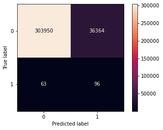

```python
import pandas as pd
import numpy as np 
import csv

import scipy.stats as scs
import statsmodels.api as sm
import statsmodels.formula.api as sms
import scipy.stats as stats

from math import sqrt

from sklearn.model_selection import train_test_split, cross_val_score
from sklearn.metrics import accuracy_score, classification_report, confusion_matrix, roc_curve, auc
from sklearn.ensemble import RandomForestClassifier, AdaBoostClassifier, GradientBoostingClassifier 
from sklearn.naive_bayes import BernoulliNB, CategoricalNB, GaussianNB, MultinomialNB
from sklearn.model_selection import GridSearchCV, train_test_split
from sklearn.metrics import classification_report, confusion_matrix, plot_confusion_matrix, accuracy_score, precision_recall_curve, f1_score, precision_score, recall_score
from sklearn.base import BaseEstimator
from sklearn.feature_selection import SelectKBest, chi2
from sklearn.tree import DecisionTreeClassifier, plot_tree
from sklearn.pipeline import Pipeline
from applesauce import model_opt, transform_df, model_scoring, cost_benefit_analysis, getList, score_report

import matplotlib.pyplot as plt
import seaborn as sns
pd.options.display.float_format = '{:.2f}'.format
```

### Purpose: Create a model that be able to take in data for a crash and then predict whether or not there was a fatality in the accident.


```python
df = pd.read_csv(r'data/ChicagoCrashes.csv')
```


```python
df.describe()
```


<div>
<style scoped>
    .dataframe tbody tr th:only-of-type {
        vertical-align: middle;
    }

    .dataframe tbody tr th {
        vertical-align: top;
    }

    .dataframe thead th {
        text-align: right;
    }
</style>
<table border="1" class="dataframe">
  <thead>
    <tr style="text-align: right;">
      <th></th>
      <th>Unnamed: 0</th>
      <th>CRASH_DATE_x</th>
      <th>OCCUPANT_CNT</th>
      <th>POSTED_SPEED_LIMIT</th>
      <th>BEAT_OF_OCCURRENCE</th>
      <th>NUM_UNITS</th>
      <th>INJURIES_TOTAL</th>
      <th>INJURIES_FATAL</th>
      <th>INJURIES_INCAPACITATING</th>
      <th>INJURIES_NON_INCAPACITATING</th>
      <th>INJURIES_REPORTED_NOT_EVIDENT</th>
      <th>INJURIES_NO_INDICATION</th>
      <th>INJURIES_UNKNOWN</th>
      <th>CRASH_HOUR</th>
      <th>CRASH_DAY_OF_WEEK</th>
      <th>CRASH_MONTH</th>
      <th>LATITUDE</th>
      <th>LONGITUDE</th>
    </tr>
  </thead>
  <tbody>
    <tr>
      <th>count</th>
      <td>567454.00</td>
      <td>567454.00</td>
      <td>567454.00</td>
      <td>567454.00</td>
      <td>567454.00</td>
      <td>567454.00</td>
      <td>567454.00</td>
      <td>567454.00</td>
      <td>567454.00</td>
      <td>567454.00</td>
      <td>567454.00</td>
      <td>567454.00</td>
      <td>567454.00</td>
      <td>567454.00</td>
      <td>567454.00</td>
      <td>567454.00</td>
      <td>567454.00</td>
      <td>567454.00</td>
    </tr>
    <tr>
      <th>mean</th>
      <td>990211.98</td>
      <td>2018.06</td>
      <td>1.41</td>
      <td>28.89</td>
      <td>1233.98</td>
      <td>2.16</td>
      <td>0.25</td>
      <td>0.00</td>
      <td>0.02</td>
      <td>0.13</td>
      <td>0.09</td>
      <td>2.74</td>
      <td>0.00</td>
      <td>13.37</td>
      <td>4.15</td>
      <td>6.72</td>
      <td>41.86</td>
      <td>-87.68</td>
    </tr>
    <tr>
      <th>std</th>
      <td>594777.08</td>
      <td>1.28</td>
      <td>1.41</td>
      <td>5.92</td>
      <td>699.58</td>
      <td>0.56</td>
      <td>0.77</td>
      <td>0.03</td>
      <td>0.19</td>
      <td>0.57</td>
      <td>0.44</td>
      <td>2.01</td>
      <td>0.00</td>
      <td>5.13</td>
      <td>1.96</td>
      <td>3.39</td>
      <td>0.08</td>
      <td>0.06</td>
    </tr>
    <tr>
      <th>min</th>
      <td>1.00</td>
      <td>2015.00</td>
      <td>0.00</td>
      <td>0.00</td>
      <td>111.00</td>
      <td>1.00</td>
      <td>0.00</td>
      <td>0.00</td>
      <td>0.00</td>
      <td>0.00</td>
      <td>0.00</td>
      <td>0.00</td>
      <td>0.00</td>
      <td>0.00</td>
      <td>1.00</td>
      <td>1.00</td>
      <td>41.64</td>
      <td>-87.93</td>
    </tr>
    <tr>
      <th>25%</th>
      <td>475494.25</td>
      <td>2017.00</td>
      <td>1.00</td>
      <td>30.00</td>
      <td>725.00</td>
      <td>2.00</td>
      <td>0.00</td>
      <td>0.00</td>
      <td>0.00</td>
      <td>0.00</td>
      <td>0.00</td>
      <td>2.00</td>
      <td>0.00</td>
      <td>10.00</td>
      <td>2.00</td>
      <td>4.00</td>
      <td>41.79</td>
      <td>-87.72</td>
    </tr>
    <tr>
      <th>50%</th>
      <td>965871.50</td>
      <td>2018.00</td>
      <td>1.00</td>
      <td>30.00</td>
      <td>1212.00</td>
      <td>2.00</td>
      <td>0.00</td>
      <td>0.00</td>
      <td>0.00</td>
      <td>0.00</td>
      <td>0.00</td>
      <td>2.00</td>
      <td>0.00</td>
      <td>14.00</td>
      <td>4.00</td>
      <td>7.00</td>
      <td>41.88</td>
      <td>-87.67</td>
    </tr>
    <tr>
      <th>75%</th>
      <td>1494691.25</td>
      <td>2019.00</td>
      <td>2.00</td>
      <td>30.00</td>
      <td>1821.00</td>
      <td>2.00</td>
      <td>0.00</td>
      <td>0.00</td>
      <td>0.00</td>
      <td>0.00</td>
      <td>0.00</td>
      <td>3.00</td>
      <td>0.00</td>
      <td>17.00</td>
      <td>6.00</td>
      <td>10.00</td>
      <td>41.92</td>
      <td>-87.63</td>
    </tr>
    <tr>
      <th>max</th>
      <td>2115933.00</td>
      <td>2020.00</td>
      <td>60.00</td>
      <td>99.00</td>
      <td>2535.00</td>
      <td>15.00</td>
      <td>21.00</td>
      <td>3.00</td>
      <td>6.00</td>
      <td>21.00</td>
      <td>15.00</td>
      <td>61.00</td>
      <td>0.00</td>
      <td>23.00</td>
      <td>7.00</td>
      <td>12.00</td>
      <td>42.02</td>
      <td>-87.52</td>
    </tr>
  </tbody>
</table>
</div>


```python
df.info()
```

    <class 'pandas.core.frame.DataFrame'>
    RangeIndex: 567454 entries, 0 to 567453
    Data columns (total 49 columns):
     #   Column                         Non-Null Count   Dtype  
    ---  ------                         --------------   -----  
     0   Unnamed: 0                     567454 non-null  int64  
     1   CRASH_DATE_x                   567454 non-null  int64  
     2   UNIT_TYPE                      567454 non-null  object 
     3   MAKE                           567454 non-null  object 
     4   MODEL                          567454 non-null  object 
     5   VEHICLE_DEFECT                 567454 non-null  object 
     6   VEHICLE_TYPE                   567454 non-null  object 
     7   VEHICLE_USE                    567454 non-null  object 
     8   MANEUVER                       567454 non-null  object 
     9   OCCUPANT_CNT                   567454 non-null  float64
     10  CRASH_DATE_y                   567454 non-null  object 
     11  POSTED_SPEED_LIMIT             567454 non-null  int64  
     12  TRAFFIC_CONTROL_DEVICE         567454 non-null  object 
     13  DEVICE_CONDITION               567454 non-null  object 
     14  WEATHER_CONDITION              567454 non-null  object 
     15  LIGHTING_CONDITION             567454 non-null  object 
     16  FIRST_CRASH_TYPE               567454 non-null  object 
     17  TRAFFICWAY_TYPE                567454 non-null  object 
     18  ALIGNMENT                      567454 non-null  object 
     19  ROADWAY_SURFACE_COND           567454 non-null  object 
     20  ROAD_DEFECT                    567454 non-null  object 
     21  REPORT_TYPE                    567454 non-null  object 
     22  CRASH_TYPE                     567454 non-null  object 
     23  DAMAGE                         567454 non-null  object 
     24  PRIM_CONTRIBUTORY_CAUSE        567454 non-null  object 
     25  SEC_CONTRIBUTORY_CAUSE         567454 non-null  object 
     26  BEAT_OF_OCCURRENCE             567454 non-null  float64
     27  NUM_UNITS                      567454 non-null  int64  
     28  MOST_SEVERE_INJURY             567454 non-null  object 
     29  INJURIES_TOTAL                 567454 non-null  float64
     30  INJURIES_FATAL                 567454 non-null  float64
     31  INJURIES_INCAPACITATING        567454 non-null  float64
     32  INJURIES_NON_INCAPACITATING    567454 non-null  float64
     33  INJURIES_REPORTED_NOT_EVIDENT  567454 non-null  float64
     34  INJURIES_NO_INDICATION         567454 non-null  float64
     35  INJURIES_UNKNOWN               567454 non-null  float64
     36  CRASH_HOUR                     567454 non-null  int64  
     37  CRASH_DAY_OF_WEEK              567454 non-null  int64  
     38  CRASH_MONTH                    567454 non-null  int64  
     39  LATITUDE                       567454 non-null  float64
     40  LONGITUDE                      567454 non-null  float64
     41  PERSON_ID                      567454 non-null  object 
     42  PERSON_TYPE                    567454 non-null  object 
     43  CRASH_DATE                     567454 non-null  object 
     44  SEX                            567454 non-null  object 
     45  SAFETY_EQUIPMENT               567454 non-null  object 
     46  AIRBAG_DEPLOYED                567454 non-null  object 
     47  EJECTION                       567454 non-null  object 
     48  INJURY_CLASSIFICATION          567454 non-null  object 
    dtypes: float64(11), int64(7), object(31)
    memory usage: 212.1+ MB
    


```python
yes_no_converter = lambda x: 1 if x>=1 else 0
```


```python
def transform_df(df): # this will create a binary encoding for fatalities in an accident,
    # 1 for a fatality was present
    # and 0 for no fatality present
    df['INJURIES_FATAL'] = df['INJURIES_FATAL'].apply(yes_no_converter)
    # df['y'] = df['y'].apply(yes_no_converter)
    return df

df = transform_df(df)
```

### KNN is not good with large or wide datasets, let's choose a different method. 


```python
df.head()
```


<div>
<style scoped>
    .dataframe tbody tr th:only-of-type {
        vertical-align: middle;
    }

    .dataframe tbody tr th {
        vertical-align: top;
    }

    .dataframe thead th {
        text-align: right;
    }
</style>
<table border="1" class="dataframe">
  <thead>
    <tr style="text-align: right;">
      <th></th>
      <th>Unnamed: 0</th>
      <th>CRASH_DATE_x</th>
      <th>UNIT_TYPE</th>
      <th>MAKE</th>
      <th>MODEL</th>
      <th>VEHICLE_DEFECT</th>
      <th>VEHICLE_TYPE</th>
      <th>VEHICLE_USE</th>
      <th>MANEUVER</th>
      <th>OCCUPANT_CNT</th>
      <th>...</th>
      <th>LATITUDE</th>
      <th>LONGITUDE</th>
      <th>PERSON_ID</th>
      <th>PERSON_TYPE</th>
      <th>CRASH_DATE</th>
      <th>SEX</th>
      <th>SAFETY_EQUIPMENT</th>
      <th>AIRBAG_DEPLOYED</th>
      <th>EJECTION</th>
      <th>INJURY_CLASSIFICATION</th>
    </tr>
  </thead>
  <tbody>
    <tr>
      <th>0</th>
      <td>577317</td>
      <td>2016</td>
      <td>DRIVER</td>
      <td>TOYOTA MOTOR COMPANY, LTD.</td>
      <td>CAMRY</td>
      <td>NONE</td>
      <td>PASSENGER</td>
      <td>PERSONAL</td>
      <td>TURNING RIGHT</td>
      <td>1.00</td>
      <td>...</td>
      <td>41.69</td>
      <td>-87.54</td>
      <td>O35015</td>
      <td>DRIVER</td>
      <td>03/18/2016 02:50:00 PM</td>
      <td>F</td>
      <td>SAFETY BELT USED</td>
      <td>DID NOT DEPLOY</td>
      <td>NONE</td>
      <td>NO INDICATION OF INJURY</td>
    </tr>
    <tr>
      <th>1</th>
      <td>1612677</td>
      <td>2019</td>
      <td>DRIVER</td>
      <td>BUICK</td>
      <td>ENCLAVE</td>
      <td>NONE</td>
      <td>PASSENGER</td>
      <td>PERSONAL</td>
      <td>STRAIGHT AHEAD</td>
      <td>1.00</td>
      <td>...</td>
      <td>41.74</td>
      <td>-87.60</td>
      <td>O804356</td>
      <td>DRIVER</td>
      <td>12/17/2019 04:04:00 PM</td>
      <td>M</td>
      <td>SAFETY BELT USED</td>
      <td>NOT APPLICABLE</td>
      <td>NONE</td>
      <td>NO INDICATION OF INJURY</td>
    </tr>
    <tr>
      <th>2</th>
      <td>547332</td>
      <td>2018</td>
      <td>DRIVER</td>
      <td>CHEVROLET</td>
      <td>MALIBU (CHEVELLE)</td>
      <td>NONE</td>
      <td>PASSENGER</td>
      <td>PERSONAL</td>
      <td>AVOIDING VEHICLES/OBJECTS</td>
      <td>1.00</td>
      <td>...</td>
      <td>41.80</td>
      <td>-87.58</td>
      <td>O337302</td>
      <td>DRIVER</td>
      <td>03/05/2018 12:35:00 PM</td>
      <td>F</td>
      <td>SAFETY BELT USED</td>
      <td>DID NOT DEPLOY</td>
      <td>NONE</td>
      <td>NO INDICATION OF INJURY</td>
    </tr>
    <tr>
      <th>3</th>
      <td>756129</td>
      <td>2018</td>
      <td>DRIVER</td>
      <td>HYUNDAI</td>
      <td>Accent</td>
      <td>NONE</td>
      <td>PASSENGER</td>
      <td>PERSONAL</td>
      <td>STRAIGHT AHEAD</td>
      <td>1.00</td>
      <td>...</td>
      <td>41.97</td>
      <td>-87.79</td>
      <td>O427371</td>
      <td>DRIVER</td>
      <td>07/07/2018 12:50:00 PM</td>
      <td>F</td>
      <td>SAFETY BELT USED</td>
      <td>DID NOT DEPLOY</td>
      <td>NONE</td>
      <td>NO INDICATION OF INJURY</td>
    </tr>
    <tr>
      <th>4</th>
      <td>95047</td>
      <td>2017</td>
      <td>DRIVER</td>
      <td>CHEVROLET</td>
      <td>MONTE CARLO</td>
      <td>NONE</td>
      <td>PASSENGER</td>
      <td>PERSONAL</td>
      <td>BACKING</td>
      <td>1.00</td>
      <td>...</td>
      <td>41.77</td>
      <td>-87.66</td>
      <td>O141732</td>
      <td>DRIVER</td>
      <td>04/01/2017 11:35:00 AM</td>
      <td>M</td>
      <td>SAFETY BELT USED</td>
      <td>DID NOT DEPLOY</td>
      <td>NONE</td>
      <td>NO INDICATION OF INJURY</td>
    </tr>
  </tbody>
</table>
<p>5 rows × 49 columns</p>
</div>


### Drop object models and objects like date that have too many data points to utilize get_dummies on the data set.


```python
df = df.drop(columns=['Unnamed: 0', 'MAKE', 'MODEL', 'LATITUDE', 'LONGITUDE', 'CRASH_DATE', 'CRASH_DATE_y', 'ALIGNMENT', 'BEAT_OF_OCCURRENCE', 'MOST_SEVERE_INJURY', 'INJURIES_TOTAL', 'INJURIES_INCAPACITATING', 'INJURIES_NON_INCAPACITATING', 'INJURIES_REPORTED_NOT_EVIDENT', 'INJURIES_NO_INDICATION', 'INJURIES_UNKNOWN', 'PERSON_ID', 'CRASH_DATE', 'INJURY_CLASSIFICATION'])
```

### Dummify the data


```python
df_dummies = pd.get_dummies(df)
```

### Perform a train test split


```python
df_train, df_valid = train_test_split(df_dummies, test_size=0.60)
```


```python
display(df_train.info())
display(df_valid.info())
```

    <class 'pandas.core.frame.DataFrame'>
    Int64Index: 226981 entries, 215211 to 79012
    Columns: 319 entries, CRASH_DATE_x to EJECTION_UNKNOWN
    dtypes: float64(1), int64(7), uint8(311)
    memory usage: 82.9 MB
    


    None


    <class 'pandas.core.frame.DataFrame'>
    Int64Index: 340473 entries, 293302 to 151384
    Columns: 319 entries, CRASH_DATE_x to EJECTION_UNKNOWN
    dtypes: float64(1), int64(7), uint8(311)
    memory usage: 124.4 MB
    


    None


### Create training variables for the training data and the test data


```python
df_train_X = df_train.drop(columns='INJURIES_FATAL')
df_train_y = df_train.loc[:,'INJURIES_FATAL']

X = df_train_X 
y = df_train_y

data_full = df_train.groupby(by='INJURIES_FATAL').sum()
data_full.to_csv('crash_data.csv')
display(X.head())
display(y.head())
```


<div>
<style scoped>
    .dataframe tbody tr th:only-of-type {
        vertical-align: middle;
    }

    .dataframe tbody tr th {
        vertical-align: top;
    }

    .dataframe thead th {
        text-align: right;
    }
</style>
<table border="1" class="dataframe">
  <thead>
    <tr style="text-align: right;">
      <th></th>
      <th>CRASH_DATE_x</th>
      <th>OCCUPANT_CNT</th>
      <th>POSTED_SPEED_LIMIT</th>
      <th>NUM_UNITS</th>
      <th>CRASH_HOUR</th>
      <th>CRASH_DAY_OF_WEEK</th>
      <th>CRASH_MONTH</th>
      <th>UNIT_TYPE_DISABLED VEHICLE</th>
      <th>UNIT_TYPE_DRIVER</th>
      <th>UNIT_TYPE_DRIVERLESS</th>
      <th>...</th>
      <th>AIRBAG_DEPLOYED_DEPLOYED, FRONT</th>
      <th>AIRBAG_DEPLOYED_DEPLOYED, SIDE</th>
      <th>AIRBAG_DEPLOYED_DEPLOYMENT UNKNOWN</th>
      <th>AIRBAG_DEPLOYED_DID NOT DEPLOY</th>
      <th>AIRBAG_DEPLOYED_NOT APPLICABLE</th>
      <th>EJECTION_NONE</th>
      <th>EJECTION_PARTIALLY EJECTED</th>
      <th>EJECTION_TOTALLY EJECTED</th>
      <th>EJECTION_TRAPPED/EXTRICATED</th>
      <th>EJECTION_UNKNOWN</th>
    </tr>
  </thead>
  <tbody>
    <tr>
      <th>215211</th>
      <td>2019</td>
      <td>2.00</td>
      <td>30</td>
      <td>3</td>
      <td>11</td>
      <td>1</td>
      <td>12</td>
      <td>0</td>
      <td>1</td>
      <td>0</td>
      <td>...</td>
      <td>0</td>
      <td>0</td>
      <td>0</td>
      <td>1</td>
      <td>0</td>
      <td>1</td>
      <td>0</td>
      <td>0</td>
      <td>0</td>
      <td>0</td>
    </tr>
    <tr>
      <th>53657</th>
      <td>2019</td>
      <td>1.00</td>
      <td>35</td>
      <td>3</td>
      <td>21</td>
      <td>2</td>
      <td>10</td>
      <td>0</td>
      <td>1</td>
      <td>0</td>
      <td>...</td>
      <td>0</td>
      <td>0</td>
      <td>0</td>
      <td>1</td>
      <td>0</td>
      <td>1</td>
      <td>0</td>
      <td>0</td>
      <td>0</td>
      <td>0</td>
    </tr>
    <tr>
      <th>43090</th>
      <td>2017</td>
      <td>1.00</td>
      <td>30</td>
      <td>2</td>
      <td>7</td>
      <td>4</td>
      <td>8</td>
      <td>0</td>
      <td>1</td>
      <td>0</td>
      <td>...</td>
      <td>0</td>
      <td>0</td>
      <td>0</td>
      <td>1</td>
      <td>0</td>
      <td>1</td>
      <td>0</td>
      <td>0</td>
      <td>0</td>
      <td>0</td>
    </tr>
    <tr>
      <th>22369</th>
      <td>2019</td>
      <td>2.00</td>
      <td>30</td>
      <td>2</td>
      <td>10</td>
      <td>1</td>
      <td>10</td>
      <td>0</td>
      <td>1</td>
      <td>0</td>
      <td>...</td>
      <td>0</td>
      <td>0</td>
      <td>1</td>
      <td>0</td>
      <td>0</td>
      <td>1</td>
      <td>0</td>
      <td>0</td>
      <td>0</td>
      <td>0</td>
    </tr>
    <tr>
      <th>258984</th>
      <td>2018</td>
      <td>5.00</td>
      <td>35</td>
      <td>3</td>
      <td>8</td>
      <td>3</td>
      <td>7</td>
      <td>0</td>
      <td>1</td>
      <td>0</td>
      <td>...</td>
      <td>0</td>
      <td>0</td>
      <td>0</td>
      <td>1</td>
      <td>0</td>
      <td>1</td>
      <td>0</td>
      <td>0</td>
      <td>0</td>
      <td>0</td>
    </tr>
  </tbody>
</table>
<p>5 rows × 318 columns</p>
</div>


    215211    0
    53657     0
    43090     0
    22369     0
    258984    0
    Name: INJURIES_FATAL, dtype: int64


```python
df_valid_X = df_valid.drop(columns='INJURIES_FATAL')
df_valid_y = df_valid.loc[:,'INJURIES_FATAL']

X_valid = df_valid_X
y_valid = df_valid_y

display(df_valid_X.head())
display(df_valid_y.head())
```


<div>
<style scoped>
    .dataframe tbody tr th:only-of-type {
        vertical-align: middle;
    }

    .dataframe tbody tr th {
        vertical-align: top;
    }

    .dataframe thead th {
        text-align: right;
    }
</style>
<table border="1" class="dataframe">
  <thead>
    <tr style="text-align: right;">
      <th></th>
      <th>CRASH_DATE_x</th>
      <th>OCCUPANT_CNT</th>
      <th>POSTED_SPEED_LIMIT</th>
      <th>NUM_UNITS</th>
      <th>CRASH_HOUR</th>
      <th>CRASH_DAY_OF_WEEK</th>
      <th>CRASH_MONTH</th>
      <th>UNIT_TYPE_DISABLED VEHICLE</th>
      <th>UNIT_TYPE_DRIVER</th>
      <th>UNIT_TYPE_DRIVERLESS</th>
      <th>...</th>
      <th>AIRBAG_DEPLOYED_DEPLOYED, FRONT</th>
      <th>AIRBAG_DEPLOYED_DEPLOYED, SIDE</th>
      <th>AIRBAG_DEPLOYED_DEPLOYMENT UNKNOWN</th>
      <th>AIRBAG_DEPLOYED_DID NOT DEPLOY</th>
      <th>AIRBAG_DEPLOYED_NOT APPLICABLE</th>
      <th>EJECTION_NONE</th>
      <th>EJECTION_PARTIALLY EJECTED</th>
      <th>EJECTION_TOTALLY EJECTED</th>
      <th>EJECTION_TRAPPED/EXTRICATED</th>
      <th>EJECTION_UNKNOWN</th>
    </tr>
  </thead>
  <tbody>
    <tr>
      <th>293302</th>
      <td>2017</td>
      <td>2.00</td>
      <td>45</td>
      <td>3</td>
      <td>9</td>
      <td>3</td>
      <td>5</td>
      <td>0</td>
      <td>1</td>
      <td>0</td>
      <td>...</td>
      <td>0</td>
      <td>1</td>
      <td>0</td>
      <td>0</td>
      <td>0</td>
      <td>1</td>
      <td>0</td>
      <td>0</td>
      <td>0</td>
      <td>0</td>
    </tr>
    <tr>
      <th>159985</th>
      <td>2018</td>
      <td>1.00</td>
      <td>30</td>
      <td>2</td>
      <td>18</td>
      <td>2</td>
      <td>8</td>
      <td>0</td>
      <td>1</td>
      <td>0</td>
      <td>...</td>
      <td>0</td>
      <td>0</td>
      <td>0</td>
      <td>1</td>
      <td>0</td>
      <td>1</td>
      <td>0</td>
      <td>0</td>
      <td>0</td>
      <td>0</td>
    </tr>
    <tr>
      <th>357479</th>
      <td>2016</td>
      <td>3.00</td>
      <td>30</td>
      <td>2</td>
      <td>7</td>
      <td>3</td>
      <td>1</td>
      <td>0</td>
      <td>1</td>
      <td>0</td>
      <td>...</td>
      <td>0</td>
      <td>0</td>
      <td>0</td>
      <td>1</td>
      <td>0</td>
      <td>1</td>
      <td>0</td>
      <td>0</td>
      <td>0</td>
      <td>0</td>
    </tr>
    <tr>
      <th>376180</th>
      <td>2017</td>
      <td>0.00</td>
      <td>30</td>
      <td>2</td>
      <td>21</td>
      <td>3</td>
      <td>2</td>
      <td>0</td>
      <td>0</td>
      <td>0</td>
      <td>...</td>
      <td>0</td>
      <td>0</td>
      <td>1</td>
      <td>0</td>
      <td>0</td>
      <td>1</td>
      <td>0</td>
      <td>0</td>
      <td>0</td>
      <td>0</td>
    </tr>
    <tr>
      <th>54523</th>
      <td>2019</td>
      <td>3.00</td>
      <td>30</td>
      <td>2</td>
      <td>18</td>
      <td>5</td>
      <td>3</td>
      <td>0</td>
      <td>1</td>
      <td>0</td>
      <td>...</td>
      <td>0</td>
      <td>0</td>
      <td>0</td>
      <td>1</td>
      <td>0</td>
      <td>1</td>
      <td>0</td>
      <td>0</td>
      <td>0</td>
      <td>0</td>
    </tr>
  </tbody>
</table>
<p>5 rows × 318 columns</p>
</div>


    293302    0
    159985    0
    357479    0
    376180    0
    54523     0
    Name: INJURIES_FATAL, dtype: int64


```python
X.shape, y.shape, X_valid.shape, y_valid.shape
```


    ((226981, 318), (226981,), (340473, 318), (340473,))


```python
df_train['INJURIES_FATAL'].value_counts(normalize=True)
```


    0   1.00
    1   0.00
    Name: INJURIES_FATAL, dtype: float64


```python
df_train.head()
```


<div>
<style scoped>
    .dataframe tbody tr th:only-of-type {
        vertical-align: middle;
    }

    .dataframe tbody tr th {
        vertical-align: top;
    }

    .dataframe thead th {
        text-align: right;
    }
</style>
<table border="1" class="dataframe">
  <thead>
    <tr style="text-align: right;">
      <th></th>
      <th>CRASH_DATE_x</th>
      <th>OCCUPANT_CNT</th>
      <th>POSTED_SPEED_LIMIT</th>
      <th>NUM_UNITS</th>
      <th>INJURIES_FATAL</th>
      <th>CRASH_HOUR</th>
      <th>CRASH_DAY_OF_WEEK</th>
      <th>CRASH_MONTH</th>
      <th>UNIT_TYPE_DISABLED VEHICLE</th>
      <th>UNIT_TYPE_DRIVER</th>
      <th>...</th>
      <th>AIRBAG_DEPLOYED_DEPLOYED, FRONT</th>
      <th>AIRBAG_DEPLOYED_DEPLOYED, SIDE</th>
      <th>AIRBAG_DEPLOYED_DEPLOYMENT UNKNOWN</th>
      <th>AIRBAG_DEPLOYED_DID NOT DEPLOY</th>
      <th>AIRBAG_DEPLOYED_NOT APPLICABLE</th>
      <th>EJECTION_NONE</th>
      <th>EJECTION_PARTIALLY EJECTED</th>
      <th>EJECTION_TOTALLY EJECTED</th>
      <th>EJECTION_TRAPPED/EXTRICATED</th>
      <th>EJECTION_UNKNOWN</th>
    </tr>
  </thead>
  <tbody>
    <tr>
      <th>215211</th>
      <td>2019</td>
      <td>2.00</td>
      <td>30</td>
      <td>3</td>
      <td>0</td>
      <td>11</td>
      <td>1</td>
      <td>12</td>
      <td>0</td>
      <td>1</td>
      <td>...</td>
      <td>0</td>
      <td>0</td>
      <td>0</td>
      <td>1</td>
      <td>0</td>
      <td>1</td>
      <td>0</td>
      <td>0</td>
      <td>0</td>
      <td>0</td>
    </tr>
    <tr>
      <th>53657</th>
      <td>2019</td>
      <td>1.00</td>
      <td>35</td>
      <td>3</td>
      <td>0</td>
      <td>21</td>
      <td>2</td>
      <td>10</td>
      <td>0</td>
      <td>1</td>
      <td>...</td>
      <td>0</td>
      <td>0</td>
      <td>0</td>
      <td>1</td>
      <td>0</td>
      <td>1</td>
      <td>0</td>
      <td>0</td>
      <td>0</td>
      <td>0</td>
    </tr>
    <tr>
      <th>43090</th>
      <td>2017</td>
      <td>1.00</td>
      <td>30</td>
      <td>2</td>
      <td>0</td>
      <td>7</td>
      <td>4</td>
      <td>8</td>
      <td>0</td>
      <td>1</td>
      <td>...</td>
      <td>0</td>
      <td>0</td>
      <td>0</td>
      <td>1</td>
      <td>0</td>
      <td>1</td>
      <td>0</td>
      <td>0</td>
      <td>0</td>
      <td>0</td>
    </tr>
    <tr>
      <th>22369</th>
      <td>2019</td>
      <td>2.00</td>
      <td>30</td>
      <td>2</td>
      <td>0</td>
      <td>10</td>
      <td>1</td>
      <td>10</td>
      <td>0</td>
      <td>1</td>
      <td>...</td>
      <td>0</td>
      <td>0</td>
      <td>1</td>
      <td>0</td>
      <td>0</td>
      <td>1</td>
      <td>0</td>
      <td>0</td>
      <td>0</td>
      <td>0</td>
    </tr>
    <tr>
      <th>258984</th>
      <td>2018</td>
      <td>5.00</td>
      <td>35</td>
      <td>3</td>
      <td>0</td>
      <td>8</td>
      <td>3</td>
      <td>7</td>
      <td>0</td>
      <td>1</td>
      <td>...</td>
      <td>0</td>
      <td>0</td>
      <td>0</td>
      <td>1</td>
      <td>0</td>
      <td>1</td>
      <td>0</td>
      <td>0</td>
      <td>0</td>
      <td>0</td>
    </tr>
  </tbody>
</table>
<p>5 rows × 319 columns</p>
</div>


### Manually sample data based on target class in order to deal with large class imbalance (~270 fatal accidents to over 560,000 non fatal accidents


```python
from sklearn.utils import resample
```


```python
df_majority = df_train.loc[df['INJURIES_FATAL']==0]
df_minority = df_train.loc[df['INJURIES_FATAL']==1]
```


```python
df_minority.shape
```


    (108, 319)


```python
df_majority.shape
```


    (226873, 319)


```python
df_min_sample = resample(df_minority, replace=True, n_samples=1000, random_state=42)
```


```python
df_maj_sample = resample(df_majority, replace=True, n_samples=5000, random_state=42)
```


```python
num_cols = df_train.drop(columns=['INJURIES_FATAL']).columns
num_cols
```


    Index(['CRASH_DATE_x', 'OCCUPANT_CNT', 'POSTED_SPEED_LIMIT', 'NUM_UNITS',
           'CRASH_HOUR', 'CRASH_DAY_OF_WEEK', 'CRASH_MONTH',
           'UNIT_TYPE_DISABLED VEHICLE', 'UNIT_TYPE_DRIVER',
           'UNIT_TYPE_DRIVERLESS',
           ...
           'AIRBAG_DEPLOYED_DEPLOYED, FRONT', 'AIRBAG_DEPLOYED_DEPLOYED, SIDE',
           'AIRBAG_DEPLOYED_DEPLOYMENT UNKNOWN', 'AIRBAG_DEPLOYED_DID NOT DEPLOY',
           'AIRBAG_DEPLOYED_NOT APPLICABLE', 'EJECTION_NONE',
           'EJECTION_PARTIALLY EJECTED', 'EJECTION_TOTALLY EJECTED',
           'EJECTION_TRAPPED/EXTRICATED', 'EJECTION_UNKNOWN'],
          dtype='object', length=318)


### Create upsampled data and smote for full feature set


```python
df_train_upsampled = pd.concat([df_min_sample, df_maj_sample], axis=0)
df_train_upsampled.shape
```


    (6000, 319)


```python
from imblearn.over_sampling import SMOTE
```


```python
X_train, y_train = df_train_upsampled[num_cols], df_train_upsampled['INJURIES_FATAL']
```


```python
smote=SMOTE()
```


```python
X_train_smote, y_train_smote = smote.fit_resample(X_train, y_train)
X_train_smote.head()
```


<div>
<style scoped>
    .dataframe tbody tr th:only-of-type {
        vertical-align: middle;
    }

    .dataframe tbody tr th {
        vertical-align: top;
    }

    .dataframe thead th {
        text-align: right;
    }
</style>
<table border="1" class="dataframe">
  <thead>
    <tr style="text-align: right;">
      <th></th>
      <th>CRASH_DATE_x</th>
      <th>OCCUPANT_CNT</th>
      <th>POSTED_SPEED_LIMIT</th>
      <th>NUM_UNITS</th>
      <th>CRASH_HOUR</th>
      <th>CRASH_DAY_OF_WEEK</th>
      <th>CRASH_MONTH</th>
      <th>UNIT_TYPE_DISABLED VEHICLE</th>
      <th>UNIT_TYPE_DRIVER</th>
      <th>UNIT_TYPE_DRIVERLESS</th>
      <th>...</th>
      <th>AIRBAG_DEPLOYED_DEPLOYED, FRONT</th>
      <th>AIRBAG_DEPLOYED_DEPLOYED, SIDE</th>
      <th>AIRBAG_DEPLOYED_DEPLOYMENT UNKNOWN</th>
      <th>AIRBAG_DEPLOYED_DID NOT DEPLOY</th>
      <th>AIRBAG_DEPLOYED_NOT APPLICABLE</th>
      <th>EJECTION_NONE</th>
      <th>EJECTION_PARTIALLY EJECTED</th>
      <th>EJECTION_TOTALLY EJECTED</th>
      <th>EJECTION_TRAPPED/EXTRICATED</th>
      <th>EJECTION_UNKNOWN</th>
    </tr>
  </thead>
  <tbody>
    <tr>
      <th>0</th>
      <td>2017</td>
      <td>2.00</td>
      <td>30</td>
      <td>2</td>
      <td>2</td>
      <td>1</td>
      <td>5</td>
      <td>0</td>
      <td>1</td>
      <td>0</td>
      <td>...</td>
      <td>0</td>
      <td>0</td>
      <td>0</td>
      <td>1</td>
      <td>0</td>
      <td>1</td>
      <td>0</td>
      <td>0</td>
      <td>0</td>
      <td>0</td>
    </tr>
    <tr>
      <th>1</th>
      <td>2020</td>
      <td>1.00</td>
      <td>30</td>
      <td>7</td>
      <td>22</td>
      <td>6</td>
      <td>7</td>
      <td>0</td>
      <td>1</td>
      <td>0</td>
      <td>...</td>
      <td>0</td>
      <td>0</td>
      <td>0</td>
      <td>0</td>
      <td>0</td>
      <td>1</td>
      <td>0</td>
      <td>0</td>
      <td>0</td>
      <td>0</td>
    </tr>
    <tr>
      <th>2</th>
      <td>2017</td>
      <td>1.00</td>
      <td>30</td>
      <td>2</td>
      <td>9</td>
      <td>1</td>
      <td>2</td>
      <td>0</td>
      <td>1</td>
      <td>0</td>
      <td>...</td>
      <td>1</td>
      <td>0</td>
      <td>0</td>
      <td>0</td>
      <td>0</td>
      <td>1</td>
      <td>0</td>
      <td>0</td>
      <td>0</td>
      <td>0</td>
    </tr>
    <tr>
      <th>3</th>
      <td>2019</td>
      <td>3.00</td>
      <td>15</td>
      <td>1</td>
      <td>6</td>
      <td>7</td>
      <td>9</td>
      <td>0</td>
      <td>1</td>
      <td>0</td>
      <td>...</td>
      <td>0</td>
      <td>0</td>
      <td>0</td>
      <td>1</td>
      <td>0</td>
      <td>1</td>
      <td>0</td>
      <td>0</td>
      <td>0</td>
      <td>0</td>
    </tr>
    <tr>
      <th>4</th>
      <td>2018</td>
      <td>1.00</td>
      <td>35</td>
      <td>2</td>
      <td>3</td>
      <td>4</td>
      <td>9</td>
      <td>0</td>
      <td>1</td>
      <td>0</td>
      <td>...</td>
      <td>0</td>
      <td>0</td>
      <td>0</td>
      <td>1</td>
      <td>0</td>
      <td>1</td>
      <td>0</td>
      <td>0</td>
      <td>0</td>
      <td>0</td>
    </tr>
  </tbody>
</table>
<p>5 rows × 318 columns</p>
</div>


### Run a Random Forest model, fit train and test on SMOTE'd data


```python
clf = RandomForestClassifier(max_depth=5, min_samples_leaf=0.1, n_estimators=30)
```


```python
clf.fit(X_train_smote, y_train_smote)
```


    RandomForestClassifier(max_depth=5, min_samples_leaf=0.1, n_estimators=30)


```python
clf.score(X_train, y_train)
```


    0.8121666666666667


```python
y_valid_pred = clf.predict(X_valid)
```


```python
X_all, y_all = df_train[num_cols], df_train['INJURIES_FATAL']
```


```python
clf.score(X_all, y_all)
```


    0.7655486582577397


```python
print(classification_report(y_valid, clf.predict(X_valid[num_cols])))
```

                  precision    recall  f1-score   support
    
               0       1.00      0.77      0.87    340314
               1       0.00      0.99      0.00       159
    
        accuracy                           0.77    340473
       macro avg       0.50      0.88      0.44    340473
    weighted avg       1.00      0.77      0.87    340473
    
    


```python
score_report(y_valid, y_valid_pred)
plot_confusion_matrix(clf, X_valid[num_cols], y_valid)
plt.show()
```

    Accuracy Score:  0.7654821380843708
    Precision Score:  0.001962450938726532
    Recall Score:  0.9874213836477987
    F1 Score:  0.003917116802435099
    


    

    


#### Confusion matrix shows that the model is giving over 79000 false positive indications of death, but is classifying a majority of actual deaths correctly. 


```python
print('''
      This is the total number of accidents with a fatality 
      divided by the total number of accidents, expressed as 
      a percent: ''',(df['INJURIES_FATAL'].sum()/df['INJURIES_FATAL'].count()*100))
print('''
      This is the total number of accidents with a fatality: ''',df['INJURIES_FATAL'].sum())
print('''
      This is the total number of accidents: ''', df['INJURIES_FATAL'].count())
```

    
          This is the total number of accidents with a fatality 
          divided by the total number of accidents, expressed as 
          a percent:  0.0470522720784416
    
          This is the total number of accidents with a fatality:  267
    
          This is the total number of accidents:  567454
    

### Use select k best to limit number of features


```python
selector = SelectKBest(score_func=chi2, k=10)
```


```python
sel = selector.fit(X_train_smote, y_train_smote)
```


```python
dfscores = sel.scores_
dfcols = X.columns

featscore = {}
for num in list(range(len(dfcols))):
    featscore[dfcols[num]] = round(dfscores[num], 2)
    
top_75 = {}
for item in sorted(featscore.items(), key=lambda x: x[1], reverse=True)[:75]:
    top_75[item[0]] = item[1]
```


```python
top_75 # most impactful features indicating a fatality is likely
```


    {'NUM_UNITS': 1348.61,
     'OCCUPANT_CNT': 356.12,
     'CRASH_MONTH': 218.6,
     'POSTED_SPEED_LIMIT': 118.67,
     'CRASH_DAY_OF_WEEK': 81.38,
     'CRASH_DATE_x': 0.43,
     'UNIT_TYPE_DISABLED VEHICLE': nan,
     'UNIT_TYPE_DRIVERLESS': 171.37,
     'CRASH_HOUR': 112.3,
     'UNIT_TYPE_NON-CONTACT VEHICLE': nan,
     'UNIT_TYPE_PARKED': 38.56,
     'VEHICLE_DEFECT_BRAKES': 11.13,
     'VEHICLE_DEFECT_CARGO': nan,
     'VEHICLE_DEFECT_ENGINE/MOTOR': nan,
     'VEHICLE_DEFECT_EXHAUST': nan,
     'VEHICLE_DEFECT_FUEL SYSTEM': nan,
     'VEHICLE_DEFECT_LIGHTS': nan,
     'VEHICLE_DEFECT_RESTRAINT SYSTEM': nan,
     'VEHICLE_DEFECT_SIGNALS': nan,
     'VEHICLE_DEFECT_SUSPENSION': nan,
     'VEHICLE_DEFECT_TRAILER COUPLING': nan,
     'VEHICLE_TYPE_3-WHEELED MOTORCYCLE (2 REAR WHEELS)': nan,
     'VEHICLE_TYPE_BUS OVER 15 PASS.': 21.35,
     'VEHICLE_TYPE_FARM EQUIPMENT': nan,
     'VEHICLE_TYPE_MOPED OR MOTORIZED BICYCLE': nan,
     'VEHICLE_TYPE_MOTORCYCLE (OVER 150CC)': 44.8,
     'UNIT_TYPE_DRIVER': 21.1,
     'VEHICLE_TYPE_BUS UP TO 15 PASS.': 16.0,
     'VEHICLE_DEFECT_STEERING': 5.0,
     'VEHICLE_TYPE_OTHER': 4.05,
     'VEHICLE_TYPE_OTHER VEHICLE WITH TRAILER': 4.0,
     'VEHICLE_DEFECT_WHEELS': 3.0,
     'VEHICLE_DEFECT_TIRES': 2.0,
     'VEHICLE_TYPE_MOTOR DRIVEN CYCLE': 2.0,
     'VEHICLE_DEFECT_WINDOWS': 1.0,
     'VEHICLE_TYPE_ALL-TERRAIN VEHICLE (ATV)': 1.0,
     'VEHICLE_TYPE_AUTOCYCLE': 1.0,
     'VEHICLE_DEFECT_NONE': 0.04,
     'VEHICLE_TYPE_RECREATIONAL OFF-HIGHWAY VEHICLE (ROV)': nan,
     'VEHICLE_TYPE_SINGLE UNIT TRUCK WITH TRAILER': nan,
     'VEHICLE_TYPE_TRUCK - SINGLE UNIT': 88.0,
     'VEHICLE_USE_AGRICULTURE': nan,
     'VEHICLE_USE_CAMPER/RV - SINGLE UNIT': nan,
     'VEHICLE_USE_CAMPER/RV - TOWED/MULTI-UNIT': nan,
     'VEHICLE_USE_HOUSE TRAILER': nan,
     'VEHICLE_USE_NOT IN USE': 289.69,
     'MANEUVER_CHANGING LANES': 114.0,
     'VEHICLE_USE_TAXI/FOR HIRE': 106.0,
     'MANEUVER_BACKING': 75.72,
     'VEHICLE_USE_OTHER': 52.63,
     'VEHICLE_USE_CTA': 52.08,
     'VEHICLE_TYPE_SPORT UTILITY VEHICLE (SUV)': 48.93,
     'VEHICLE_USE_PERSONAL': 40.95,
     'VEHICLE_USE_COMMERCIAL - MULTI-UNIT': 31.02,
     'VEHICLE_USE_COMMERCIAL - SINGLE UNIT': 28.82,
     'VEHICLE_USE_SCHOOL BUS': 27.0,
     'VEHICLE_USE_OTHER TRANSIT': 25.0,
     'VEHICLE_TYPE_TRACTOR W/ SEMI-TRAILER': 24.64,
     'MANEUVER_AVOIDING VEHICLES/OBJECTS': 23.0,
     'VEHICLE_USE_CONSTRUCTION/MAINTENANCE': 22.0,
     'VEHICLE_USE_UNKNOWN/NA': 16.2,
     'VEHICLE_USE_TOW TRUCK': 13.56,
     'VEHICLE_USE_MASS TRANSIT': 11.0,
     'VEHICLE_TYPE_VAN/MINI-VAN': 10.2,
     'VEHICLE_USE_FIRE': 6.0,
     'VEHICLE_USE_AMBULANCE': 5.0,
     'VEHICLE_USE_STATE OWNED': 4.0,
     'VEHICLE_TYPE_PICKUP': 2.26,
     'VEHICLE_TYPE_TRACTOR W/O SEMI-TRAILER': 2.0,
     'VEHICLE_USE_RIDESHARE SERVICE': 1.71,
     'VEHICLE_TYPE_PASSENGER': 1.5,
     'VEHICLE_USE_DRIVER EDUCATION': 1.0,
     'VEHICLE_USE_LAWN CARE/LANDSCAPING': 1.0,
     'MANEUVER_DISABLED': nan,
     'MANEUVER_DIVERGING': 2.0}


```python
# def getList(dict):
#     return dict.keys()

new_features = getList(top_75)
```


```python
top75_features = list(new_features)
print(top75_features)
```

    ['NUM_UNITS', 'OCCUPANT_CNT', 'CRASH_MONTH', 'POSTED_SPEED_LIMIT', 'CRASH_DAY_OF_WEEK', 'CRASH_DATE_x', 'UNIT_TYPE_DISABLED VEHICLE', 'UNIT_TYPE_DRIVERLESS', 'CRASH_HOUR', 'UNIT_TYPE_NON-CONTACT VEHICLE', 'UNIT_TYPE_PARKED', 'VEHICLE_DEFECT_BRAKES', 'VEHICLE_DEFECT_CARGO', 'VEHICLE_DEFECT_ENGINE/MOTOR', 'VEHICLE_DEFECT_EXHAUST', 'VEHICLE_DEFECT_FUEL SYSTEM', 'VEHICLE_DEFECT_LIGHTS', 'VEHICLE_DEFECT_RESTRAINT SYSTEM', 'VEHICLE_DEFECT_SIGNALS', 'VEHICLE_DEFECT_SUSPENSION', 'VEHICLE_DEFECT_TRAILER COUPLING', 'VEHICLE_TYPE_3-WHEELED MOTORCYCLE (2 REAR WHEELS)', 'VEHICLE_TYPE_BUS OVER 15 PASS.', 'VEHICLE_TYPE_FARM EQUIPMENT', 'VEHICLE_TYPE_MOPED OR MOTORIZED BICYCLE', 'VEHICLE_TYPE_MOTORCYCLE (OVER 150CC)', 'UNIT_TYPE_DRIVER', 'VEHICLE_TYPE_BUS UP TO 15 PASS.', 'VEHICLE_DEFECT_STEERING', 'VEHICLE_TYPE_OTHER', 'VEHICLE_TYPE_OTHER VEHICLE WITH TRAILER', 'VEHICLE_DEFECT_WHEELS', 'VEHICLE_DEFECT_TIRES', 'VEHICLE_TYPE_MOTOR DRIVEN CYCLE', 'VEHICLE_DEFECT_WINDOWS', 'VEHICLE_TYPE_ALL-TERRAIN VEHICLE (ATV)', 'VEHICLE_TYPE_AUTOCYCLE', 'VEHICLE_DEFECT_NONE', 'VEHICLE_TYPE_RECREATIONAL OFF-HIGHWAY VEHICLE (ROV)', 'VEHICLE_TYPE_SINGLE UNIT TRUCK WITH TRAILER', 'VEHICLE_TYPE_TRUCK - SINGLE UNIT', 'VEHICLE_USE_AGRICULTURE', 'VEHICLE_USE_CAMPER/RV - SINGLE UNIT', 'VEHICLE_USE_CAMPER/RV - TOWED/MULTI-UNIT', 'VEHICLE_USE_HOUSE TRAILER', 'VEHICLE_USE_NOT IN USE', 'MANEUVER_CHANGING LANES', 'VEHICLE_USE_TAXI/FOR HIRE', 'MANEUVER_BACKING', 'VEHICLE_USE_OTHER', 'VEHICLE_USE_CTA', 'VEHICLE_TYPE_SPORT UTILITY VEHICLE (SUV)', 'VEHICLE_USE_PERSONAL', 'VEHICLE_USE_COMMERCIAL - MULTI-UNIT', 'VEHICLE_USE_COMMERCIAL - SINGLE UNIT', 'VEHICLE_USE_SCHOOL BUS', 'VEHICLE_USE_OTHER TRANSIT', 'VEHICLE_TYPE_TRACTOR W/ SEMI-TRAILER', 'MANEUVER_AVOIDING VEHICLES/OBJECTS', 'VEHICLE_USE_CONSTRUCTION/MAINTENANCE', 'VEHICLE_USE_UNKNOWN/NA', 'VEHICLE_USE_TOW TRUCK', 'VEHICLE_USE_MASS TRANSIT', 'VEHICLE_TYPE_VAN/MINI-VAN', 'VEHICLE_USE_FIRE', 'VEHICLE_USE_AMBULANCE', 'VEHICLE_USE_STATE OWNED', 'VEHICLE_TYPE_PICKUP', 'VEHICLE_TYPE_TRACTOR W/O SEMI-TRAILER', 'VEHICLE_USE_RIDESHARE SERVICE', 'VEHICLE_TYPE_PASSENGER', 'VEHICLE_USE_DRIVER EDUCATION', 'VEHICLE_USE_LAWN CARE/LANDSCAPING', 'MANEUVER_DISABLED', 'MANEUVER_DIVERGING']
    

### Create SelectKBest features variable


```python
feature_list = top75_features
X2 = X_train_smote.loc[:,feature_list]
y2 = y_train_smote
# df_valid_X2 = df_valid[feature_list]
df_valid_X2 = df_valid_X.loc[:,feature_list]
```

### Optimize the model using a for loop and model type


```python
ran_for = RandomForestClassifier()
ada_clf = AdaBoostClassifier()
gb_clf = GradientBoostingClassifier()
gau_NB = GaussianNB()

models = [ran_for, ada_clf, gb_clf, gau_NB]
```


```python
model_opt(models, X_train_smote, y_train_smote, X_valid, y_valid) # full dataset
# of all models run, the base RFC tree is the best most accurate and 
# precise model for predicting whether or not a death occurred
```

    Accuracy Score:  0.9997180393158929
    Precision Score:  0.8
    Recall Score:  0.5283018867924528
    F1 Score:  0.6363636363636364
    RandomForestClassifier()   0.9997180393158929
    


    

    


    Accuracy Score:  0.9435109391934162
    Precision Score:  0.006774927596193628
    Recall Score:  0.8238993710691824
    F1 Score:  0.013439343421390101
    AdaBoostClassifier()   0.9435109391934162
    


    

    


    Accuracy Score:  0.9474965709468885
    Precision Score:  0.007395873880887505
    Recall Score:  0.8364779874213837
    F1 Score:  0.014662110020945873
    GradientBoostingClassifier()   0.9474965709468885
    


    

    


    Accuracy Score:  0.8315461137887585
    Precision Score:  0.002297290241737587
    Recall Score:  0.8301886792452831
    F1 Score:  0.004581901489117984
    GaussianNB()   0.8315461137887585
    


    

    


```python
def single_model_opt(model, x, y, xtest, ytest):
    pipe = Pipeline(steps=[('model', model)])
    fit = pipe.fit(x, y)
    ypred = model.predict(xtest)
    score_report(ytest, ypred)
    print(model," ", fit.score(xtest, ytest))
    plot_confusion_matrix(model, xtest, ytest, values_format='1')
    plt.show()
    pass
```


```python
single_model_opt(ran_for, X_train_smote, y_train_smote, X_valid, y_valid)
```

    Accuracy Score:  0.9997297876777307
    Precision Score:  0.819047619047619
    Recall Score:  0.5408805031446541
    F1 Score:  0.6515151515151515
    RandomForestClassifier()   0.9997297876777307
    


    

    


### This model is the the most accurate and has a reasonable recall score. There are less than 120 false positives out of over 340,000 negatives to classify. 

### Additionally, recall of over 60% while is excellent in combination with overall accuracy.

### Out of the above models, Random Forest performs the best. Let's see if after applying feature selection if it continues to perform better than the other models. 


```python
model_opt(models, X2, y2, df_valid_X2, y_valid) # this is the reduced feature set
```

    Accuracy Score:  0.9986078191222212
    Precision Score:  0.17255717255717257
    Recall Score:  0.5220125786163522
    F1 Score:  0.259375
    RandomForestClassifier()   0.9986078191222212
    


    

    


    Accuracy Score:  0.8619831822200292
    Precision Score:  0.002337838986653065
    Recall Score:  0.6918238993710691
    F1 Score:  0.004659930948295948
    AdaBoostClassifier()   0.8619831822200292
    


    

    


    Accuracy Score:  0.9269868682685558
    Precision Score:  0.0039762229897983776
    Recall Score:  0.6226415094339622
    F1 Score:  0.007901983477670911
    GradientBoostingClassifier()   0.9269868682685558
    


    

    


    Accuracy Score:  0.09217177279843042
    Precision Score:  0.0004753804660668896
    Recall Score:  0.9245283018867925
    F1 Score:  0.0009502723144302407
    GaussianNB()   0.09217177279843042
    


    

    


# Random Forest performed worse with a reduced set of features. 


```python
# GridsearchCV and improving the full set Random Forest classifier with full set of features
```

### Tuning Hyper-parameters for a random forest model 


```python
# create single item lists for input to model_opt and also gridsearchCV. 
selected_model = [ran_for]
```


```python
for model in selected_model:
    print(model.get_params().keys())
```

    dict_keys(['bootstrap', 'ccp_alpha', 'class_weight', 'criterion', 'max_depth', 'max_features', 'max_leaf_nodes', 'max_samples', 'min_impurity_decrease', 'min_impurity_split', 'min_samples_leaf', 'min_samples_split', 'min_weight_fraction_leaf', 'n_estimators', 'n_jobs', 'oob_score', 'random_state', 'verbose', 'warm_start'])
    


```python
# pipe_random = Pipeline([
#     ('select', SelectKBest()),
#     ('model', ran_for)])
# pipe_bayes = Pipeline([
#     ('select', SelectKBest()),
#     ('model', cat_bayes)])
```


```python
ran_for = RandomForestClassifier()
cat_bayes = CategoricalNB()
param_random = {
    "max_depth": [3,5,7,11,15],
    "n_estimators": range(5,50,5),
    "max_leaf_nodes": range(3,10,2),
    "max_features": range(5,50,5)
    }
```


```python
# need to improve on overall precision, so scoring for both models will be precision
gsforest = GridSearchCV(estimator=ran_for, param_grid=param_random, cv=5, scoring='precision', 
                    verbose=1, n_jobs=6)
```


```python
# initial SMOTED training set
gsforest.fit(X_train_smote, y_train_smote)
```

    Fitting 5 folds for each of 1620 candidates, totalling 8100 fits
    

    [Parallel(n_jobs=6)]: Using backend LokyBackend with 6 concurrent workers.
    [Parallel(n_jobs=6)]: Done  38 tasks      | elapsed:    3.1s
    [Parallel(n_jobs=6)]: Done 188 tasks      | elapsed:    6.8s
    [Parallel(n_jobs=6)]: Done 438 tasks      | elapsed:   14.3s
    [Parallel(n_jobs=6)]: Done 788 tasks      | elapsed:   27.0s
    [Parallel(n_jobs=6)]: Done 1238 tasks      | elapsed:   46.2s
    [Parallel(n_jobs=6)]: Done 1788 tasks      | elapsed:  1.2min
    [Parallel(n_jobs=6)]: Done 2438 tasks      | elapsed:  1.6min
    [Parallel(n_jobs=6)]: Done 3188 tasks      | elapsed:  2.3min
    [Parallel(n_jobs=6)]: Done 4038 tasks      | elapsed:  2.9min
    [Parallel(n_jobs=6)]: Done 4988 tasks      | elapsed:  3.9min
    [Parallel(n_jobs=6)]: Done 6038 tasks      | elapsed:  4.8min
    [Parallel(n_jobs=6)]: Done 7188 tasks      | elapsed:  5.7min
    [Parallel(n_jobs=6)]: Done 8100 out of 8100 | elapsed:  6.7min finished
    


    GridSearchCV(cv=5, estimator=RandomForestClassifier(), n_jobs=6,
                 param_grid={'max_depth': [3, 5, 7, 11, 15],
                             'max_features': range(5, 50, 5),
                             'max_leaf_nodes': range(3, 10, 2),
                             'n_estimators': range(5, 50, 5)},
                 scoring='precision', verbose=1)


```python
y_preds = gsforest.predict(X_valid)
```


```python
sum(y_preds)
```


    39407


```python
plot_confusion_matrix(gsforest, X_valid, y_valid, cmap='rocket', values_format='1')
plt.show()
```


    

    


```python
gsforest_f1 = gsforest.best_estimator_
gsforest_f1
```


    RandomForestClassifier(max_depth=7, max_features=5, max_leaf_nodes=9,
                           n_estimators=35)


```python
print(gsforest_f1.score(X_train_smote, y_train_smote))
print(gsforest_f1.score(X_valid, y_valid)) # model is not overfit
```

    0.8969
    0.8845194773153818
    


```python
gsforest_f1.fit(X_train_smote, y_train_smote)
```


    RandomForestClassifier(max_depth=7, max_features=5, max_leaf_nodes=9,
                           n_estimators=35)


```python
y_preds = gsforest_f1.predict(X_valid)
sum(y_preds)
```


    40697


```python
plot_confusion_matrix(gsforest_f1, X_valid, y_valid, cmap='rocket', values_format='1')
plt.show()
```


    

    


```python
gsforest.fit(X2, y2)
```

    Fitting 5 folds for each of 1620 candidates, totalling 8100 fits
    

    [Parallel(n_jobs=6)]: Using backend LokyBackend with 6 concurrent workers.
    [Parallel(n_jobs=6)]: Done  64 tasks      | elapsed:    2.0s
    [Parallel(n_jobs=6)]: Done 364 tasks      | elapsed:   11.8s
    [Parallel(n_jobs=6)]: Done 864 tasks      | elapsed:   31.6s
    [Parallel(n_jobs=6)]: Done 1564 tasks      | elapsed:  1.1min
    [Parallel(n_jobs=6)]: Done 2464 tasks      | elapsed:  1.7min
    [Parallel(n_jobs=6)]: Done 3564 tasks      | elapsed:  2.6min
    [Parallel(n_jobs=6)]: Done 4856 tasks      | elapsed:  3.8min
    [Parallel(n_jobs=6)]: Done 5606 tasks      | elapsed:  4.2min
    [Parallel(n_jobs=6)]: Done 6456 tasks      | elapsed:  5.1min
    [Parallel(n_jobs=6)]: Done 7406 tasks      | elapsed:  5.8min
    [Parallel(n_jobs=6)]: Done 8100 out of 8100 | elapsed:  6.6min finished
    


    GridSearchCV(cv=5, estimator=RandomForestClassifier(), n_jobs=6,
                 param_grid={'max_depth': [3, 5, 7, 11, 15],
                             'max_features': range(5, 50, 5),
                             'max_leaf_nodes': range(3, 10, 2),
                             'n_estimators': range(5, 50, 5)},
                 scoring='precision', verbose=1)


```python
gsforest.best_estimator_
```


    RandomForestClassifier(max_depth=5, max_features=15, max_leaf_nodes=9,
                           n_estimators=45)


```python
gsforest_high_precision_partial = gsforest.best_estimator_
gsforest_high_precision_partial
```


    RandomForestClassifier(max_depth=5, max_features=15, max_leaf_nodes=9,
                           n_estimators=45)


```python
gsforest_high_precision_partial.predict(X2)
```


    array([1, 1, 0, ..., 1, 1, 0], dtype=int64)


```python
y_preds2 = gsforest_high_precision_partial.predict(X2)
```


```python
plot_confusion_matrix(gsforest_high_precision_partial, df_valid_X2, y_valid, cmap='rocket', values_format='1')
plt.show() 
```


    

    


```python
clf = RandomForestClassifier(n_estimators=50, random_state=42, max_features=40)
clf.fit(X_train_smote, y_train_smote)
y_preds_clf = clf.predict(X_valid)
```


```python
model_opt(clf, X_train_smote, y_train_smote, X_valid, y_valid)
plt.show()
```

    Accuracy Score:  0.9904955752732229
    Precision Score:  0.02617801047120419
    Recall Score:  0.5345911949685535
    F1 Score:  0.049911920140927775
    DecisionTreeClassifier(max_features=40, random_state=1608637542)   0.9904955752732229
    


    

    


    Accuracy Score:  0.9875379251805576
    Precision Score:  0.01998119417019276
    Recall Score:  0.5345911949685535
    F1 Score:  0.038522547020167684
    DecisionTreeClassifier(max_features=40, random_state=1273642419)   0.9875379251805576
    


    

    


    Accuracy Score:  0.9878257600455836
    Precision Score:  0.02045235803657363
    Recall Score:  0.5345911949685535
    F1 Score:  0.03939745075318656
    DecisionTreeClassifier(max_features=40, random_state=1935803228)   0.9878257600455836
    


    

    


    Accuracy Score:  0.986997500536019
    Precision Score:  0.017849073655671035
    Recall Score:  0.4968553459119497
    F1 Score:  0.03446019629225736
    DecisionTreeClassifier(max_features=40, random_state=787846414)   0.986997500536019
    


    

    


    Accuracy Score:  0.9888331820731747
    Precision Score:  0.023292331850300968
    Recall Score:  0.559748427672956
    F1 Score:  0.044723618090452257
    DecisionTreeClassifier(max_features=40, random_state=996406378)   0.9888331820731747
    


    

    


    Accuracy Score:  0.990974321018113
    Precision Score:  0.022920759659463
    Recall Score:  0.44025157232704404
    F1 Score:  0.04357298474945534
    DecisionTreeClassifier(max_features=40, random_state=1201263687)   0.990974321018113
    


    

    


    Accuracy Score:  0.989822981558009
    Precision Score:  0.02308136180034622
    Recall Score:  0.5031446540880503
    F1 Score:  0.044137931034482755
    DecisionTreeClassifier(max_features=40, random_state=423734972)   0.989822981558009
    


    

    


    Accuracy Score:  0.9913032751495713
    Precision Score:  0.02668918918918919
    Recall Score:  0.4968553459119497
    F1 Score:  0.05065726194293044
    DecisionTreeClassifier(max_features=40, random_state=415968276)   0.9913032751495713
    


    

    


    Accuracy Score:  0.9896555674018204
    Precision Score:  0.0224368077250781
    Recall Score:  0.4968553459119497
    F1 Score:  0.042934782608695654
    DecisionTreeClassifier(max_features=40, random_state=670094950)   0.9896555674018204
    


    

    


    Accuracy Score:  0.9872677128582883
    Precision Score:  0.019337016574585635
    Recall Score:  0.5283018867924528
    F1 Score:  0.037308461025982675
    DecisionTreeClassifier(max_features=40, random_state=1914837113)   0.9872677128582883
    


    

    


    Accuracy Score:  0.9858197272617799
    Precision Score:  0.019353510397364628
    Recall Score:  0.5911949685534591
    F1 Score:  0.037480063795853266
    DecisionTreeClassifier(max_features=40, random_state=669991378)   0.9858197272617799
    


    

    


    Accuracy Score:  0.9914148845870304
    Precision Score:  0.027682843472317156
    Recall Score:  0.5094339622641509
    F1 Score:  0.05251215559157212
    DecisionTreeClassifier(max_features=40, random_state=429389014)   0.9914148845870304
    


    

    


    Accuracy Score:  0.9877640811459352
    Precision Score:  0.021951801479360534
    Recall Score:  0.5786163522012578
    F1 Score:  0.042298850574712644
    DecisionTreeClassifier(max_features=40, random_state=249467210)   0.9877640811459352
    


    

    


    Accuracy Score:  0.988900735153742
    Precision Score:  0.022175290390707498
    Recall Score:  0.5283018867924528
    F1 Score:  0.04256397263744616
    DecisionTreeClassifier(max_features=40, random_state=1972458954)   0.988900735153742
    


    

    


    Accuracy Score:  0.9910712450032748
    Precision Score:  0.028169014084507043
    Recall Score:  0.5408805031446541
    F1 Score:  0.053549190535491904
    DecisionTreeClassifier(max_features=40, random_state=1572714583)   0.9910712450032748
    


    

    


    Accuracy Score:  0.9907569763241139
    Precision Score:  0.02631578947368421
    Recall Score:  0.5220125786163522
    F1 Score:  0.05010564443102928
    DecisionTreeClassifier(max_features=40, random_state=1433267572)   0.9907569763241139
    


    

    


    Accuracy Score:  0.9871972226872615
    Precision Score:  0.021422060164083864
    Recall Score:  0.5911949685534591
    F1 Score:  0.04134594237959094
    DecisionTreeClassifier(max_features=40, random_state=434285667)   0.9871972226872615
    


    

    


    Accuracy Score:  0.9889712253247688
    Precision Score:  0.02155401809473124
    Recall Score:  0.5094339622641509
    F1 Score:  0.04135818228235895
    DecisionTreeClassifier(max_features=40, random_state=613608295)   0.9889712253247688
    


    

    


    Accuracy Score:  0.9864600129819399
    Precision Score:  0.01922661481961547
    Recall Score:  0.559748427672956
    F1 Score:  0.03717627401837928
    DecisionTreeClassifier(max_features=40, random_state=893664919)   0.9864600129819399
    


    

    


    Accuracy Score:  0.9870386198024513
    Precision Score:  0.017687074829931974
    Recall Score:  0.49056603773584906
    F1 Score:  0.03414313854235063
    DecisionTreeClassifier(max_features=40, random_state=648061058)   0.9870386198024513
    


    

    


    Accuracy Score:  0.9845626525451358
    Precision Score:  0.017238113279030118
    Recall Score:  0.5723270440251572
    F1 Score:  0.03346818683339463
    DecisionTreeClassifier(max_features=40, random_state=88409749)   0.9845626525451358
    


    

    


    Accuracy Score:  0.9877024022462868
    Precision Score:  0.021160247265810745
    Recall Score:  0.559748427672956
    F1 Score:  0.04077892325315005
    DecisionTreeClassifier(max_features=40, random_state=242285876)   0.9877024022462868
    


    

    


    Accuracy Score:  0.9906453668866547
    Precision Score:  0.025705329153605017
    Recall Score:  0.5157232704402516
    F1 Score:  0.04896984174380412
    DecisionTreeClassifier(max_features=40, random_state=2018247425)   0.9906453668866547
    


    

    


    Accuracy Score:  0.9886598937360672
    Precision Score:  0.023919753086419752
    Recall Score:  0.5849056603773585
    F1 Score:  0.045959970348406216
    DecisionTreeClassifier(max_features=40, random_state=953477463)   0.9886598937360672
    


    

    


    Accuracy Score:  0.9889712253247688
    Precision Score:  0.023834745762711863
    Recall Score:  0.5660377358490566
    F1 Score:  0.045743329097839895
    DecisionTreeClassifier(max_features=40, random_state=1427830251)   0.9889712253247688
    


    

    


    Accuracy Score:  0.9888008740781208
    Precision Score:  0.022727272727272728
    Recall Score:  0.5471698113207547
    F1 Score:  0.0436418359668924
    DecisionTreeClassifier(max_features=40, random_state=1883569565)   0.9888008740781208
    


    

    


    Accuracy Score:  0.984001668267381
    Precision Score:  0.012177121771217712
    Recall Score:  0.41509433962264153
    F1 Score:  0.023660154149489153
    DecisionTreeClassifier(max_features=40, random_state=911989541)   0.984001668267381
    


    

    


    Accuracy Score:  0.9894646565219563
    Precision Score:  0.02468108707709373
    Recall Score:  0.559748427672956
    F1 Score:  0.047277556440903055
    DecisionTreeClassifier(max_features=40, random_state=3344769)   0.9894646565219563
    


    

    


    Accuracy Score:  0.9877347102413407
    Precision Score:  0.021671826625386997
    Recall Score:  0.5723270440251572
    F1 Score:  0.041762276273519965
    DecisionTreeClassifier(max_features=40, random_state=780932287)   0.9877347102413407
    


    

    


    Accuracy Score:  0.9880401676491234
    Precision Score:  0.021755072109508677
    Recall Score:  0.559748427672956
    F1 Score:  0.04188235294117647
    DecisionTreeClassifier(max_features=40, random_state=2114032571)   0.9880401676491234
    


    

    


    Accuracy Score:  0.9877905149600703
    Precision Score:  0.020393474088291747
    Recall Score:  0.5345911949685535
    F1 Score:  0.03928819043217009
    DecisionTreeClassifier(max_features=40, random_state=787716372)   0.9877905149600703
    


    

    


    Accuracy Score:  0.9883309396046088
    Precision Score:  0.02133534136546185
    Recall Score:  0.5345911949685535
    F1 Score:  0.041033067825247405
    DecisionTreeClassifier(max_features=40, random_state=504579232)   0.9883309396046088
    


    

    


    Accuracy Score:  0.9891327653000385
    Precision Score:  0.02135712354690457
    Recall Score:  0.4968553459119497
    F1 Score:  0.04095386210471747
    DecisionTreeClassifier(max_features=40, random_state=1306710475)   0.9891327653000385
    


    

    


    Accuracy Score:  0.9888860497014448
    Precision Score:  0.01884788956729493
    Recall Score:  0.44654088050314467
    F1 Score:  0.03616912888436067
    DecisionTreeClassifier(max_features=40, random_state=479546681)   0.9888860497014448
    


    

    


    Accuracy Score:  0.9874498124667742
    Precision Score:  0.01916783543712015
    Recall Score:  0.5157232704402516
    F1 Score:  0.03696191120126211
    DecisionTreeClassifier(max_features=40, random_state=106328085)   0.9874498124667742
    


    

    


    Accuracy Score:  0.9888654900682287
    Precision Score:  0.02033808769149498
    Recall Score:  0.48427672955974843
    F1 Score:  0.039036755386565265
    DecisionTreeClassifier(max_features=40, random_state=30349564)   0.9888654900682287
    


    

    


    Accuracy Score:  0.9876789055226112
    Precision Score:  0.020209224916785545
    Recall Score:  0.5345911949685535
    F1 Score:  0.038946162657502864
    DecisionTreeClassifier(max_features=40, random_state=1855189739)   0.9876789055226112
    


    

    


    Accuracy Score:  0.9861428072123193
    Precision Score:  0.018585005279831045
    Recall Score:  0.5534591194968553
    F1 Score:  0.035962402942378416
    DecisionTreeClassifier(max_features=40, random_state=99052376)   0.9861428072123193
    


    

    


    Accuracy Score:  0.9886363970123916
    Precision Score:  0.020671834625323
    Recall Score:  0.5031446540880503
    F1 Score:  0.03971208736659221
    DecisionTreeClassifier(max_features=40, random_state=1250819632)   0.9886363970123916
    


    

    


    Accuracy Score:  0.9854937102207811
    Precision Score:  0.015605999189298744
    Recall Score:  0.48427672955974843
    F1 Score:  0.03023758099352052
    DecisionTreeClassifier(max_features=40, random_state=106406362)   0.9854937102207811
    


    

    


    Accuracy Score:  0.9873470143006935
    Precision Score:  0.021011313784345415
    Recall Score:  0.5723270440251572
    F1 Score:  0.04053452115812917
    DecisionTreeClassifier(max_features=40, random_state=480404538)   0.9873470143006935
    


    

    


    Accuracy Score:  0.9886892646406616
    Precision Score:  0.02101712506486767
    Recall Score:  0.5094339622641509
    F1 Score:  0.04036880139546475
    DecisionTreeClassifier(max_features=40, random_state=1717389822)   0.9886892646406616
    


    

    


    Accuracy Score:  0.9870768019784242
    Precision Score:  0.021223752540076767
    Recall Score:  0.5911949685534591
    F1 Score:  0.040976460331299036
    DecisionTreeClassifier(max_features=40, random_state=599121577)   0.9870768019784242
    


    

    


    Accuracy Score:  0.9886540195551483
    Precision Score:  0.024640657084188913
    Recall Score:  0.6037735849056604
    F1 Score:  0.04734895191122071
    DecisionTreeClassifier(max_features=40, random_state=200427519)   0.9886540195551483
    


    

    


    Accuracy Score:  0.9877552698745569
    Precision Score:  0.01710019267822736
    Recall Score:  0.44654088050314467
    F1 Score:  0.0329389932730225
    DecisionTreeClassifier(max_features=40, random_state=1254751707)   0.9877552698745569
    


    

    


    Accuracy Score:  0.9876201637134222
    Precision Score:  0.019203413940256046
    Recall Score:  0.5094339622641509
    F1 Score:  0.037011651816312545
    DecisionTreeClassifier(max_features=40, random_state=2034764475)   0.9876201637134222
    


    

    


    Accuracy Score:  0.989135702390498
    Precision Score:  0.021621621621621623
    Recall Score:  0.5031446540880503
    F1 Score:  0.041461518528116095
    DecisionTreeClassifier(max_features=40, random_state=1573512143)   0.989135702390498
    


    

    


    Accuracy Score:  0.9881928963530148
    Precision Score:  0.020610876583064316
    Recall Score:  0.5220125786163522
    F1 Score:  0.03965599617773531
    DecisionTreeClassifier(max_features=40, random_state=999745294)   0.9881928963530148
    


    

    


    Accuracy Score:  0.9894059147127673
    Precision Score:  0.024019878520154612
    Recall Score:  0.5471698113207547
    F1 Score:  0.04601957154192013
    DecisionTreeClassifier(max_features=40, random_state=1958805693)   0.9894059147127673
    


    

    


    Accuracy Score:  0.9883720588710412
    Precision Score:  0.019230769230769232
    Recall Score:  0.4779874213836478
    F1 Score:  0.0369739722695208
    DecisionTreeClassifier(max_features=40, random_state=389151677)   0.9883720588710412
    


    

    


```python
ran_for.fit(X_train_smote, y_train_smote)
```


    RandomForestClassifier()


```python
cost_benefit_analysis(ran_for, X_valid, y_valid)
```


    -0.0024671559859372107


```python

```


```python

```


```python

```


```python

```


```python

```


```python

```


```python

```


```python

```


```python

```
