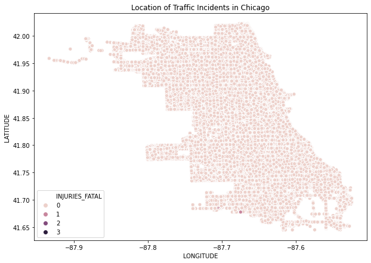
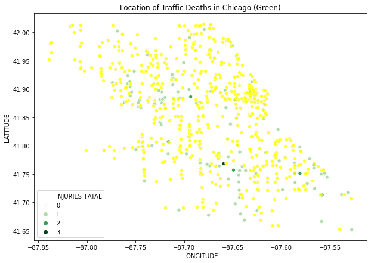
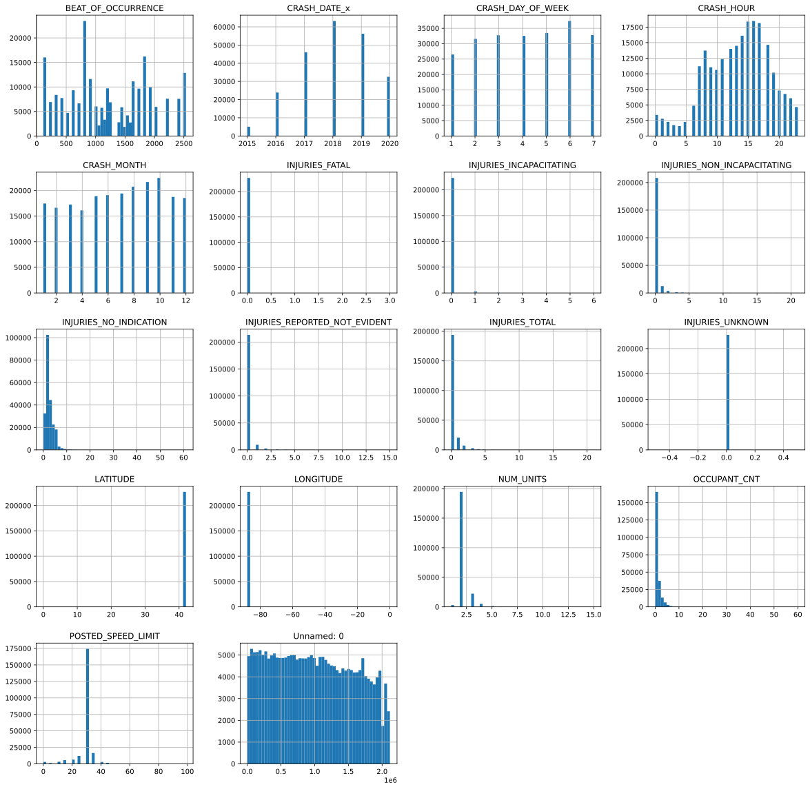

```python
import pandas as pd
import numpy as np 
import csv

import scipy.stats as scs
import statsmodels.api as sm
import statsmodels.formula.api as sms
import scipy.stats as stats

from math import sqrt

from sklearn.preprocessing import OneHotEncoder
from sklearn.tree import DecisionTreeClassifier
from sklearn import tree
from sklearn.feature_selection import SelectKBest, chi2
from sklearn.metrics import accuracy_score, confusion_matrix, classification_report

import matplotlib.pyplot as plt
import seaborn as sns
```

## Question 1

### What parts of Chicago have the most fatalities?


```python
df = pd.read_csv(r'data\ChicagoCrashes.csv')
```


```python
df.describe()
```


<div>
<style scoped>
    .dataframe tbody tr th:only-of-type {
        vertical-align: middle;
    }

    .dataframe tbody tr th {
        vertical-align: top;
    }

    .dataframe thead th {
        text-align: right;
    }
</style>
<table border="1" class="dataframe">
  <thead>
    <tr style="text-align: right;">
      <th></th>
      <th>Unnamed: 0</th>
      <th>CRASH_DATE_x</th>
      <th>OCCUPANT_CNT</th>
      <th>POSTED_SPEED_LIMIT</th>
      <th>BEAT_OF_OCCURRENCE</th>
      <th>NUM_UNITS</th>
      <th>INJURIES_TOTAL</th>
      <th>INJURIES_FATAL</th>
      <th>INJURIES_INCAPACITATING</th>
      <th>INJURIES_NON_INCAPACITATING</th>
      <th>INJURIES_REPORTED_NOT_EVIDENT</th>
      <th>INJURIES_NO_INDICATION</th>
      <th>INJURIES_UNKNOWN</th>
      <th>CRASH_HOUR</th>
      <th>CRASH_DAY_OF_WEEK</th>
      <th>CRASH_MONTH</th>
      <th>LATITUDE</th>
      <th>LONGITUDE</th>
    </tr>
  </thead>
  <tbody>
    <tr>
      <th>count</th>
      <td>1.134909e+06</td>
      <td>1.134909e+06</td>
      <td>1.134909e+06</td>
      <td>1.134909e+06</td>
      <td>1.134909e+06</td>
      <td>1.134909e+06</td>
      <td>1.134909e+06</td>
      <td>1.134909e+06</td>
      <td>1.134909e+06</td>
      <td>1.134909e+06</td>
      <td>1.134909e+06</td>
      <td>1.134909e+06</td>
      <td>1134909.0</td>
      <td>1.134909e+06</td>
      <td>1.134909e+06</td>
      <td>1.134909e+06</td>
      <td>1.134909e+06</td>
      <td>1.134909e+06</td>
    </tr>
    <tr>
      <th>mean</th>
      <td>9.897487e+05</td>
      <td>2.018056e+03</td>
      <td>1.415067e+00</td>
      <td>2.888418e+01</td>
      <td>1.233346e+03</td>
      <td>2.165137e+00</td>
      <td>2.475802e-01</td>
      <td>6.035726e-04</td>
      <td>2.275249e-02</td>
      <td>1.326565e-01</td>
      <td>9.156769e-02</td>
      <td>2.736757e+00</td>
      <td>0.0</td>
      <td>1.336699e+01</td>
      <td>4.147727e+00</td>
      <td>6.720912e+00</td>
      <td>4.185953e+01</td>
      <td>-8.767939e+01</td>
    </tr>
    <tr>
      <th>std</th>
      <td>5.947572e+05</td>
      <td>1.283893e+00</td>
      <td>1.418414e+00</td>
      <td>5.913001e+00</td>
      <td>6.996664e+02</td>
      <td>5.622482e-01</td>
      <td>7.719307e-01</td>
      <td>2.972218e-02</td>
      <td>1.928180e-01</td>
      <td>5.708199e-01</td>
      <td>4.417917e-01</td>
      <td>2.003230e+00</td>
      <td>0.0</td>
      <td>5.136826e+00</td>
      <td>1.960023e+00</td>
      <td>3.394992e+00</td>
      <td>8.411052e-02</td>
      <td>5.818758e-02</td>
    </tr>
    <tr>
      <th>min</th>
      <td>0.000000e+00</td>
      <td>2.015000e+03</td>
      <td>0.000000e+00</td>
      <td>0.000000e+00</td>
      <td>1.110000e+02</td>
      <td>1.000000e+00</td>
      <td>0.000000e+00</td>
      <td>0.000000e+00</td>
      <td>0.000000e+00</td>
      <td>0.000000e+00</td>
      <td>0.000000e+00</td>
      <td>0.000000e+00</td>
      <td>0.0</td>
      <td>0.000000e+00</td>
      <td>1.000000e+00</td>
      <td>1.000000e+00</td>
      <td>4.164467e+01</td>
      <td>-8.793401e+01</td>
    </tr>
    <tr>
      <th>25%</th>
      <td>4.751850e+05</td>
      <td>2.017000e+03</td>
      <td>1.000000e+00</td>
      <td>3.000000e+01</td>
      <td>7.250000e+02</td>
      <td>2.000000e+00</td>
      <td>0.000000e+00</td>
      <td>0.000000e+00</td>
      <td>0.000000e+00</td>
      <td>0.000000e+00</td>
      <td>0.000000e+00</td>
      <td>2.000000e+00</td>
      <td>0.0</td>
      <td>1.000000e+01</td>
      <td>2.000000e+00</td>
      <td>4.000000e+00</td>
      <td>4.178761e+01</td>
      <td>-8.772198e+01</td>
    </tr>
    <tr>
      <th>50%</th>
      <td>9.654550e+05</td>
      <td>2.018000e+03</td>
      <td>1.000000e+00</td>
      <td>3.000000e+01</td>
      <td>1.212000e+03</td>
      <td>2.000000e+00</td>
      <td>0.000000e+00</td>
      <td>0.000000e+00</td>
      <td>0.000000e+00</td>
      <td>0.000000e+00</td>
      <td>0.000000e+00</td>
      <td>2.000000e+00</td>
      <td>0.0</td>
      <td>1.400000e+01</td>
      <td>4.000000e+00</td>
      <td>7.000000e+00</td>
      <td>4.187639e+01</td>
      <td>-8.767473e+01</td>
    </tr>
    <tr>
      <th>75%</th>
      <td>1.493715e+06</td>
      <td>2.019000e+03</td>
      <td>2.000000e+00</td>
      <td>3.000000e+01</td>
      <td>1.821000e+03</td>
      <td>2.000000e+00</td>
      <td>0.000000e+00</td>
      <td>0.000000e+00</td>
      <td>0.000000e+00</td>
      <td>0.000000e+00</td>
      <td>0.000000e+00</td>
      <td>3.000000e+00</td>
      <td>0.0</td>
      <td>1.700000e+01</td>
      <td>6.000000e+00</td>
      <td>1.000000e+01</td>
      <td>4.192375e+01</td>
      <td>-8.763316e+01</td>
    </tr>
    <tr>
      <th>max</th>
      <td>2.115933e+06</td>
      <td>2.020000e+03</td>
      <td>6.000000e+01</td>
      <td>9.900000e+01</td>
      <td>2.535000e+03</td>
      <td>1.500000e+01</td>
      <td>2.100000e+01</td>
      <td>3.000000e+00</td>
      <td>6.000000e+00</td>
      <td>2.100000e+01</td>
      <td>1.500000e+01</td>
      <td>6.100000e+01</td>
      <td>0.0</td>
      <td>2.300000e+01</td>
      <td>7.000000e+00</td>
      <td>1.200000e+01</td>
      <td>4.202278e+01</td>
      <td>-8.752459e+01</td>
    </tr>
  </tbody>
</table>
</div>


```python
df2 = df.sample(frac=0.0005)
```


```python
df.info()
```

    <class 'pandas.core.frame.DataFrame'>
    RangeIndex: 1134909 entries, 0 to 1134908
    Data columns (total 49 columns):
     #   Column                         Non-Null Count    Dtype  
    ---  ------                         --------------    -----  
     0   Unnamed: 0                     1134909 non-null  int64  
     1   CRASH_DATE_x                   1134909 non-null  int64  
     2   UNIT_TYPE                      1134909 non-null  object 
     3   MAKE                           1134909 non-null  object 
     4   MODEL                          1134909 non-null  object 
     5   VEHICLE_DEFECT                 1134909 non-null  object 
     6   VEHICLE_TYPE                   1134909 non-null  object 
     7   VEHICLE_USE                    1134909 non-null  object 
     8   MANEUVER                       1134909 non-null  object 
     9   OCCUPANT_CNT                   1134909 non-null  float64
     10  CRASH_DATE_y                   1134909 non-null  object 
     11  POSTED_SPEED_LIMIT             1134909 non-null  int64  
     12  TRAFFIC_CONTROL_DEVICE         1134909 non-null  object 
     13  DEVICE_CONDITION               1134909 non-null  object 
     14  WEATHER_CONDITION              1134909 non-null  object 
     15  LIGHTING_CONDITION             1134909 non-null  object 
     16  FIRST_CRASH_TYPE               1134909 non-null  object 
     17  TRAFFICWAY_TYPE                1134909 non-null  object 
     18  ALIGNMENT                      1134909 non-null  object 
     19  ROADWAY_SURFACE_COND           1134909 non-null  object 
     20  ROAD_DEFECT                    1134909 non-null  object 
     21  REPORT_TYPE                    1134909 non-null  object 
     22  CRASH_TYPE                     1134909 non-null  object 
     23  DAMAGE                         1134909 non-null  object 
     24  PRIM_CONTRIBUTORY_CAUSE        1134909 non-null  object 
     25  SEC_CONTRIBUTORY_CAUSE         1134909 non-null  object 
     26  BEAT_OF_OCCURRENCE             1134909 non-null  float64
     27  NUM_UNITS                      1134909 non-null  int64  
     28  MOST_SEVERE_INJURY             1134909 non-null  object 
     29  INJURIES_TOTAL                 1134909 non-null  float64
     30  INJURIES_FATAL                 1134909 non-null  float64
     31  INJURIES_INCAPACITATING        1134909 non-null  float64
     32  INJURIES_NON_INCAPACITATING    1134909 non-null  float64
     33  INJURIES_REPORTED_NOT_EVIDENT  1134909 non-null  float64
     34  INJURIES_NO_INDICATION         1134909 non-null  float64
     35  INJURIES_UNKNOWN               1134909 non-null  float64
     36  CRASH_HOUR                     1134909 non-null  int64  
     37  CRASH_DAY_OF_WEEK              1134909 non-null  int64  
     38  CRASH_MONTH                    1134909 non-null  int64  
     39  LATITUDE                       1134909 non-null  float64
     40  LONGITUDE                      1134909 non-null  float64
     41  PERSON_ID                      1134909 non-null  object 
     42  PERSON_TYPE                    1134909 non-null  object 
     43  CRASH_DATE                     1134909 non-null  object 
     44  SEX                            1134909 non-null  object 
     45  SAFETY_EQUIPMENT               1134909 non-null  object 
     46  AIRBAG_DEPLOYED                1134909 non-null  object 
     47  EJECTION                       1134909 non-null  object 
     48  INJURY_CLASSIFICATION          1134909 non-null  object 
    dtypes: float64(11), int64(7), object(31)
    memory usage: 424.3+ MB
    


```python
df1 = df[df['INJURIES_FATAL'] > 0]
```


```python
plt.figure(figsize=(10,7))
sns.scatterplot(x=df['LONGITUDE'],y=df['LATITUDE'],hue=df['INJURIES_FATAL'])
plt.legend(loc='lower left')
plt.title('Location of Traffic Deaths in Chicago')
plt.show()
```


    

    


```python
plt.figure(figsize=(10,7))
sns.scatterplot(x=df1['LONGITUDE'],y=df1['LATITUDE'],hue=df['INJURIES_FATAL'],palette='Greens')
sns.scatterplot(x=df2['LONGITUDE'],y=df2['LATITUDE'],color='Yellow',legend='brief',alpha=.8)
plt.legend(loc='lower left')
plt.title('Location of Traffic Deaths in Chicago (Green)')
plt.show()
```


    

    


## Question 1 Insights

#### We can see that there is no discernible pattern to location. In the Graph above we can see the outline of Lake Michigan along the upper righthand side, with fatal accidents present at random locations around the Downtown Chicago Area.


```python

```


```python

```


```python
# INJURIES_FATAL lists total fatalities in the incident
# df['MOST_SEVERE_INJURY'].unique()
# df.INJURIES_FATAL[df['INJURIES_FATAL']>1] = 1
# df.INJURIES_FATAL[df['INJURIES_FATAL']==0] = 0
df.INJURIES_FATAL.sum()
#
```


    140.0


```python
df['CRASH_DAY_OF_WEEK'].unique() # Sunday = 1
```


    array([5, 2, 7, 4, 1, 6, 3], dtype=int64)


```python
df.hist(figsize=(20,20),bins=50)
plt.show()
# quick observations - more likely to get in an accident on a Friday.
# after or around 3 PM to 5 PM (rush hour)
# October is most likely month in which to have an accident
# Speed limit in the Chicago city area is generally 35 MPH 
# most accidents involve 1 person only. 
```


    

    


### Train Test Split and OneHotEncode


```python
# create a map 
# vehicle_defect_pairs = []

# for ix, row in enumerate(df.select("VEHICLE_DEFECT").distinct().collect()):
#   pair = (ix, row.VEHICLE_DEFECT)
#   vehicle_defect_pairs.append(pair)
# vehicle_defect_pairs
```


```python
# feature_list = []

# for col in df.columns:
#   if col in ("_c0", "CRASH_RECORD_ID", "RD_NO_x", "CRASH_DATE_x", "VEHICLE_ID_x", "MODEL", "CRASH_DATE_y", "DATE_POLICE_NOTIFIED", "BEAT_OF_OCCURRENCE", "MOST_SEVERE_INJURY", "PERSON_ID", "RD_NO", "INJURY_CLASSIFICATION", "LOCATION", "LONGITUDE", "LATITUDE", "CRASH_TYPE"):
#     continue
#   else:
#     feature_list.append(col)

# assembler = VectorAssembler(inputCols=feature_list, outputCol="features")
```


```python
# # # Remove "object"-type features from df
# cont_features = [col for col in df.columns if df[col].dtype in [np.float64, np.int64]]

# # # Remove "object"-type features from df
# df_cont = df.loc[:, cont_features]
```


```python
# # Create df_cat which contains only the categorical variables
# features_cat = [col for col in df.columns if df[col].dtype in [np.object]]
# other_ind = []
# for col in features_cat:
#     others = list(df[df[col].str.contains("OTHER")].index)
#     for oth in others:
#         if oth in other_ind:
#             continue
#         else: other_ind.append(oth)
    
# df.drop(other_ind, inplace=True)
# df_cat = df.loc[:, features_cat]
# df_target = df.loc[:, ['INJURIES_FATAL']]
```


```python
# df_target['INJURIES_FATAL'] = df_target['INJURIES_FATAL'].astype('category')

# df = df.drop("INJURIES_FATAL", axis=1)
```


```python
# X = df[['MAKE', 'MODEL', 'VEHICLE_DEFECT', 'VEHICLE_TYPE', 'OCCUPANT_CNT', 'MANEUVER', 'WEATHER_CONDITION', 'LIGHTING_CONDITION', 'ROAD_DEFECT', 'CRASH_TYPE', 'CRASH_HOUR','CRASH_DAY_OF_WEEK', 'PERSON_TYPE', 'SEX', 'EJECTION', 'SAFETY_EQUIPMENT']]
# X = df.drop(columns='INJURIES_FATAL')
# target = df['INJURIES_FATAL']
```


```python
# create a map 
# vehicle_defect_pairs = []

# for ix, row in enumerate(df.select("VEHICLE_DEFECT").distinct().collect()):
#   pair = (ix, row.VEHICLE_DEFECT)
#   vehicle_defect_pairs.append(pair)
# vehicle_defect_pairs
```


```python

```


```python

```


```python

```
