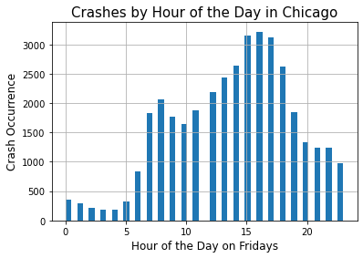

```python
import pandas as pd
import numpy as np 
import csv

import scipy.stats as scs
import statsmodels.api as sm
import statsmodels.formula.api as sms
import scipy.stats as stats

from haversine import haversine
from math import sqrt

from sklearn.model_selection import train_test_split, cross_val_score
from sklearn.linear_model import LinearRegression
from sklearn.feature_selection import f_regression
import sklearn.metrics as metrics

import matplotlib.pyplot as plt
import seaborn as sns
```

## Question 2

### What times of the day and on what weekdays are traffic collisions more common?


```python
df = pd.read_csv(r'data\Sample2.csv')
```


```python
df.info()
```

    <class 'pandas.core.frame.DataFrame'>
    RangeIndex: 226982 entries, 0 to 226981
    Data columns (total 49 columns):
     #   Column                         Non-Null Count   Dtype  
    ---  ------                         --------------   -----  
     0   Unnamed: 0                     226982 non-null  int64  
     1   CRASH_DATE_x                   226982 non-null  int64  
     2   UNIT_TYPE                      226982 non-null  object 
     3   MAKE                           226982 non-null  object 
     4   MODEL                          226982 non-null  object 
     5   VEHICLE_DEFECT                 226982 non-null  object 
     6   VEHICLE_TYPE                   226982 non-null  object 
     7   VEHICLE_USE                    226982 non-null  object 
     8   MANEUVER                       226982 non-null  object 
     9   OCCUPANT_CNT                   226982 non-null  float64
     10  CRASH_DATE_y                   226982 non-null  object 
     11  POSTED_SPEED_LIMIT             226982 non-null  int64  
     12  TRAFFIC_CONTROL_DEVICE         226982 non-null  object 
     13  DEVICE_CONDITION               226982 non-null  object 
     14  WEATHER_CONDITION              226982 non-null  object 
     15  LIGHTING_CONDITION             226982 non-null  object 
     16  FIRST_CRASH_TYPE               226982 non-null  object 
     17  TRAFFICWAY_TYPE                226982 non-null  object 
     18  ALIGNMENT                      226982 non-null  object 
     19  ROADWAY_SURFACE_COND           226982 non-null  object 
     20  ROAD_DEFECT                    226982 non-null  object 
     21  REPORT_TYPE                    226982 non-null  object 
     22  CRASH_TYPE                     226982 non-null  object 
     23  DAMAGE                         226982 non-null  object 
     24  PRIM_CONTRIBUTORY_CAUSE        226982 non-null  object 
     25  SEC_CONTRIBUTORY_CAUSE         226982 non-null  object 
     26  BEAT_OF_OCCURRENCE             226982 non-null  float64
     27  NUM_UNITS                      226982 non-null  int64  
     28  MOST_SEVERE_INJURY             226982 non-null  object 
     29  INJURIES_TOTAL                 226982 non-null  float64
     30  INJURIES_FATAL                 226982 non-null  float64
     31  INJURIES_INCAPACITATING        226982 non-null  float64
     32  INJURIES_NON_INCAPACITATING    226982 non-null  float64
     33  INJURIES_REPORTED_NOT_EVIDENT  226982 non-null  float64
     34  INJURIES_NO_INDICATION         226982 non-null  float64
     35  INJURIES_UNKNOWN               226982 non-null  float64
     36  CRASH_HOUR                     226982 non-null  int64  
     37  CRASH_DAY_OF_WEEK              226982 non-null  int64  
     38  CRASH_MONTH                    226982 non-null  int64  
     39  LATITUDE                       226982 non-null  float64
     40  LONGITUDE                      226982 non-null  float64
     41  PERSON_ID                      226982 non-null  object 
     42  PERSON_TYPE                    226982 non-null  object 
     43  CRASH_DATE                     226982 non-null  object 
     44  SEX                            226982 non-null  object 
     45  SAFETY_EQUIPMENT               226982 non-null  object 
     46  AIRBAG_DEPLOYED                226982 non-null  object 
     47  EJECTION                       226982 non-null  object 
     48  INJURY_CLASSIFICATION          226982 non-null  object 
    dtypes: float64(11), int64(7), object(31)
    memory usage: 84.9+ MB
    


```python
df['CRASH_HOUR'].hist(bins=48)
plt.title("Crashes by Hour of the Day in Chicago",fontsize=15)
plt.ylabel('Crash Occurrence',fontsize=12)
plt.xlabel('Hour of the Day', fontsize=12)
plt.show()
```


    

    


```python
df['CRASH_DAY_OF_WEEK'].hist(bins=14)
plt.title("Crashes by Day of the Week in Chicago",fontsize=15)
plt.ylabel('Crash Occurrence',fontsize=12)
plt.xlabel('Day of the Week, Day 1 is Sunday', fontsize=12)
plt.show()
```


    

    


```python
df1=df[df['CRASH_DAY_OF_WEEK']==6]
```


```python
# Let's also look at just Friday, Day 6
df1['CRASH_HOUR'].hist(bins=48)
plt.title("Crashes by Hour of the Day in Chicago",fontsize=15)
plt.ylabel('Crash Occurrence',fontsize=12)
plt.xlabel('Hour of the Day on Fridays', fontsize=12)
plt.show()
```


    

    


```python
# Similar pattern to the entire week
```

## Question 2 Insights
#### The hours between 2 and 6 pm see elevated accident rates - this is invariably because of rush hour when there are simply more vehicles on the roads and increased opportunity for accidents. While there are more accidents on Fridays, the pattern for accidents by the hour is much the same as the rest of the week. 


```python

```
