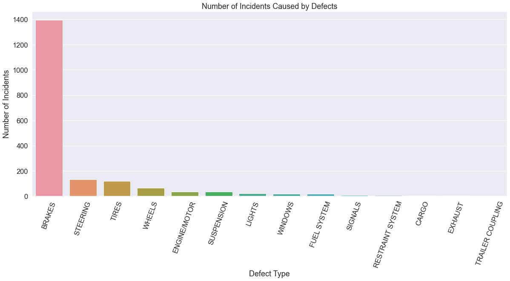

```python
import pandas as pd
import numpy as np 
import csv

import scipy.stats as scs
import statsmodels.api as sm
import statsmodels.formula.api as sms
import scipy.stats as stats

from pltfunctions import hist_kde_plots
from haversine import haversine
from math import sqrt

from sklearn.model_selection import train_test_split, cross_val_score
from sklearn.linear_model import LinearRegression
from sklearn.feature_selection import f_regression
import sklearn.metrics as metrics

import matplotlib.pyplot as plt
import seaborn as sns
```

## Question 3

### What vehicle defect is most common in reported crashes in the Chicago area?


```python
df = pd.read_csv(r'data\Sample3.csv')
```


```python
df_defect=df.groupby(df['VEHICLE_DEFECT']).count().sort_values(by='CRASH_DATE_x', ascending=False).drop(index='NONE').reset_index()
```


```python
df_defect
```


<div>
<style scoped>
    .dataframe tbody tr th:only-of-type {
        vertical-align: middle;
    }

    .dataframe tbody tr th {
        vertical-align: top;
    }

    .dataframe thead th {
        text-align: right;
    }
</style>
<table border="1" class="dataframe">
  <thead>
    <tr style="text-align: right;">
      <th></th>
      <th>VEHICLE_DEFECT</th>
      <th>Unnamed: 0</th>
      <th>CRASH_DATE_x</th>
      <th>UNIT_TYPE</th>
      <th>MAKE</th>
      <th>MODEL</th>
      <th>VEHICLE_TYPE</th>
      <th>VEHICLE_USE</th>
      <th>MANEUVER</th>
      <th>OCCUPANT_CNT</th>
      <th>...</th>
      <th>LATITUDE</th>
      <th>LONGITUDE</th>
      <th>PERSON_ID</th>
      <th>PERSON_TYPE</th>
      <th>CRASH_DATE</th>
      <th>SEX</th>
      <th>SAFETY_EQUIPMENT</th>
      <th>AIRBAG_DEPLOYED</th>
      <th>EJECTION</th>
      <th>INJURY_CLASSIFICATION</th>
    </tr>
  </thead>
  <tbody>
    <tr>
      <th>0</th>
      <td>BRAKES</td>
      <td>1394</td>
      <td>1394</td>
      <td>1394</td>
      <td>1394</td>
      <td>1394</td>
      <td>1394</td>
      <td>1394</td>
      <td>1394</td>
      <td>1394</td>
      <td>...</td>
      <td>1394</td>
      <td>1394</td>
      <td>1394</td>
      <td>1394</td>
      <td>1394</td>
      <td>1394</td>
      <td>1394</td>
      <td>1394</td>
      <td>1394</td>
      <td>1394</td>
    </tr>
    <tr>
      <th>1</th>
      <td>STEERING</td>
      <td>132</td>
      <td>132</td>
      <td>132</td>
      <td>132</td>
      <td>132</td>
      <td>132</td>
      <td>132</td>
      <td>132</td>
      <td>132</td>
      <td>...</td>
      <td>132</td>
      <td>132</td>
      <td>132</td>
      <td>132</td>
      <td>132</td>
      <td>132</td>
      <td>132</td>
      <td>132</td>
      <td>132</td>
      <td>132</td>
    </tr>
    <tr>
      <th>2</th>
      <td>TIRES</td>
      <td>120</td>
      <td>120</td>
      <td>120</td>
      <td>120</td>
      <td>120</td>
      <td>120</td>
      <td>120</td>
      <td>120</td>
      <td>120</td>
      <td>...</td>
      <td>120</td>
      <td>120</td>
      <td>120</td>
      <td>120</td>
      <td>120</td>
      <td>120</td>
      <td>120</td>
      <td>120</td>
      <td>120</td>
      <td>120</td>
    </tr>
    <tr>
      <th>3</th>
      <td>WHEELS</td>
      <td>64</td>
      <td>64</td>
      <td>64</td>
      <td>64</td>
      <td>64</td>
      <td>64</td>
      <td>64</td>
      <td>64</td>
      <td>64</td>
      <td>...</td>
      <td>64</td>
      <td>64</td>
      <td>64</td>
      <td>64</td>
      <td>64</td>
      <td>64</td>
      <td>64</td>
      <td>64</td>
      <td>64</td>
      <td>64</td>
    </tr>
    <tr>
      <th>4</th>
      <td>ENGINE/MOTOR</td>
      <td>35</td>
      <td>35</td>
      <td>35</td>
      <td>35</td>
      <td>35</td>
      <td>35</td>
      <td>35</td>
      <td>35</td>
      <td>35</td>
      <td>...</td>
      <td>35</td>
      <td>35</td>
      <td>35</td>
      <td>35</td>
      <td>35</td>
      <td>35</td>
      <td>35</td>
      <td>35</td>
      <td>35</td>
      <td>35</td>
    </tr>
    <tr>
      <th>5</th>
      <td>SUSPENSION</td>
      <td>34</td>
      <td>34</td>
      <td>34</td>
      <td>34</td>
      <td>34</td>
      <td>34</td>
      <td>34</td>
      <td>34</td>
      <td>34</td>
      <td>...</td>
      <td>34</td>
      <td>34</td>
      <td>34</td>
      <td>34</td>
      <td>34</td>
      <td>34</td>
      <td>34</td>
      <td>34</td>
      <td>34</td>
      <td>34</td>
    </tr>
    <tr>
      <th>6</th>
      <td>LIGHTS</td>
      <td>23</td>
      <td>23</td>
      <td>23</td>
      <td>23</td>
      <td>23</td>
      <td>23</td>
      <td>23</td>
      <td>23</td>
      <td>23</td>
      <td>...</td>
      <td>23</td>
      <td>23</td>
      <td>23</td>
      <td>23</td>
      <td>23</td>
      <td>23</td>
      <td>23</td>
      <td>23</td>
      <td>23</td>
      <td>23</td>
    </tr>
    <tr>
      <th>7</th>
      <td>WINDOWS</td>
      <td>19</td>
      <td>19</td>
      <td>19</td>
      <td>19</td>
      <td>19</td>
      <td>19</td>
      <td>19</td>
      <td>19</td>
      <td>19</td>
      <td>...</td>
      <td>19</td>
      <td>19</td>
      <td>19</td>
      <td>19</td>
      <td>19</td>
      <td>19</td>
      <td>19</td>
      <td>19</td>
      <td>19</td>
      <td>19</td>
    </tr>
    <tr>
      <th>8</th>
      <td>FUEL SYSTEM</td>
      <td>17</td>
      <td>17</td>
      <td>17</td>
      <td>17</td>
      <td>17</td>
      <td>17</td>
      <td>17</td>
      <td>17</td>
      <td>17</td>
      <td>...</td>
      <td>17</td>
      <td>17</td>
      <td>17</td>
      <td>17</td>
      <td>17</td>
      <td>17</td>
      <td>17</td>
      <td>17</td>
      <td>17</td>
      <td>17</td>
    </tr>
    <tr>
      <th>9</th>
      <td>SIGNALS</td>
      <td>9</td>
      <td>9</td>
      <td>9</td>
      <td>9</td>
      <td>9</td>
      <td>9</td>
      <td>9</td>
      <td>9</td>
      <td>9</td>
      <td>...</td>
      <td>9</td>
      <td>9</td>
      <td>9</td>
      <td>9</td>
      <td>9</td>
      <td>9</td>
      <td>9</td>
      <td>9</td>
      <td>9</td>
      <td>9</td>
    </tr>
    <tr>
      <th>10</th>
      <td>RESTRAINT SYSTEM</td>
      <td>8</td>
      <td>8</td>
      <td>8</td>
      <td>8</td>
      <td>8</td>
      <td>8</td>
      <td>8</td>
      <td>8</td>
      <td>8</td>
      <td>...</td>
      <td>8</td>
      <td>8</td>
      <td>8</td>
      <td>8</td>
      <td>8</td>
      <td>8</td>
      <td>8</td>
      <td>8</td>
      <td>8</td>
      <td>8</td>
    </tr>
    <tr>
      <th>11</th>
      <td>CARGO</td>
      <td>4</td>
      <td>4</td>
      <td>4</td>
      <td>4</td>
      <td>4</td>
      <td>4</td>
      <td>4</td>
      <td>4</td>
      <td>4</td>
      <td>...</td>
      <td>4</td>
      <td>4</td>
      <td>4</td>
      <td>4</td>
      <td>4</td>
      <td>4</td>
      <td>4</td>
      <td>4</td>
      <td>4</td>
      <td>4</td>
    </tr>
    <tr>
      <th>12</th>
      <td>EXHAUST</td>
      <td>4</td>
      <td>4</td>
      <td>4</td>
      <td>4</td>
      <td>4</td>
      <td>4</td>
      <td>4</td>
      <td>4</td>
      <td>4</td>
      <td>...</td>
      <td>4</td>
      <td>4</td>
      <td>4</td>
      <td>4</td>
      <td>4</td>
      <td>4</td>
      <td>4</td>
      <td>4</td>
      <td>4</td>
      <td>4</td>
    </tr>
    <tr>
      <th>13</th>
      <td>TRAILER COUPLING</td>
      <td>1</td>
      <td>1</td>
      <td>1</td>
      <td>1</td>
      <td>1</td>
      <td>1</td>
      <td>1</td>
      <td>1</td>
      <td>1</td>
      <td>...</td>
      <td>1</td>
      <td>1</td>
      <td>1</td>
      <td>1</td>
      <td>1</td>
      <td>1</td>
      <td>1</td>
      <td>1</td>
      <td>1</td>
      <td>1</td>
    </tr>
  </tbody>
</table>
<p>14 rows × 49 columns</p>
</div>


```python
fig_dims = (20,8)
fig, ax = plt.subplots(figsize=fig_dims)
sns.set(font_scale=1.5)
sns.set_style("darkgrid")
palette = sns.set_palette("dark")
ax = sns.barplot(x=df_defect['VEHICLE_DEFECT'], y=df_defect['CRASH_DATE_x'])
ax.set(xlabel="Defect Type", ylabel="Number of Incidents")
plt.ticklabel_format(style='plain',axis='y')
plt.xticks(rotation=70)
plt.title('Number of Incidents Caused by Defects')
plt.show()
```


    

    


## Question 3 Insights
#### There is no vehicle defect for the majority of accidents in the Chicago Area. However, when a vehicle defect is listed, the majority of accidents are caused by malfunctioning brakes. Brake inspections for state registrations could be more demanding of individuals' vehicles.


```python

```


```python

```


```python

```
